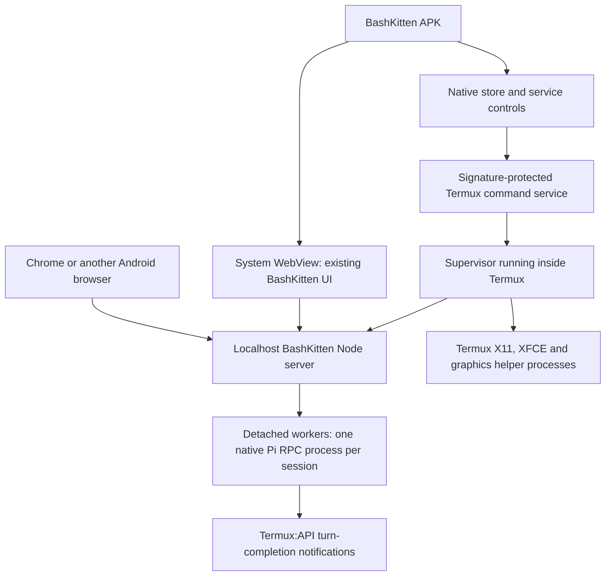

# BashKitten Android and Termux suite: implementation plan

Status: proposed implementation, researched 19–20 September 2026. The `main`
branch supplies the web UI and native Pi adapter, promoted from `codex/pi-termux-rpc`. This
document adds a plan for the Android host, signed Termux distribution, package
installation, lifecycle controls and desktop integration. It does not describe
those additions as already implemented or tested.

## 1. Product and process ownership

Build a Kotlin Android BashKitten app with a system WebView for the existing chat
UI and a native store/control screen. Termux owns every backend, Pi and desktop
process. The store remains available before Termux is installed and whenever the
web server is stopped. Ordinary Android browsers continue to use the same
authenticated `http://127.0.0.1:3939` application.



The current transcript renderer, tool/thinking streaming, output styling,
compaction presentation, themes, session naming and project sidebar remain the
UI. Preserve native Pi history and credentials. Narrow screens use collapsible
project and file drawers; wide screens can show projects, chat and files together.
Keep the expandable repository browser in the top bar.

WildBuzzard is not a dependency, installation requirement or implementation
target for this work. A future app signed with the suite certificate can request
the same Termux command permission independently.

## 2. Repositories and release ownership

| Repository | Responsibility | Published artifacts |
| --- | --- | --- |
| `openresearchtools/bashkitten` | Existing web UI and Pi adapter; new `android/`, lifecycle manager and Termux packaging | BashKitten APK, `bashkitten_VERSION_aarch64.deb`, source and release metadata |
| Proposed `openresearchtools/termux-suite` | Tracked upstream Termux sources, patch series, build/signing workflows and suite catalog | Termux/add-on APKs, both X11 variants, matched X11 companion `.deb`, complete source archive and signed catalog |
| Existing `openresearchtools/apt` | Existing signed native Termux package index and keyring | Current keyring and signed indexes referencing application release assets |

Proposed suite layout:

```text
sources/termux-app/
sources/termux-api/
sources/termux-x11/
sources/termux-boot/
sources/termux-widget/
sources/termux-styling/
sources/termux-float/
sources/termux-tasker/
patches/termux-app/series
patches/build-config/...
build/...
catalog/...
licenses/...
upstream.lock.json
.github/workflows/...
```

Import actual files at recorded upstream commits. Expand nested upstream
submodules, including X11 dependencies, so a source download contains their
contents. Keep upstream trees pristine and apply the documented patch series to
a build staging directory. Updating upstream is a source-import commit followed
by explicit patch refreshes; CI fails when a patch no longer applies.

Every released APK must identify its upstream commit, suite revision, build
inputs and matching source artifact. Publish source, patches, build scripts and
required corresponding source for redistributed components, including the
bootstrap where applicable. Do not assume GitHub's automatic tag archive includes
downloaded dependencies. Preserve individual licenses, exceptions, attribution
and modification notices; expose them in the store's source/licenses view.
Termux app identifies its main license as GPLv3-only with exceptions, and X11
also carries GPLv3. See [Termux licensing](https://github.com/termux/termux-app/blob/master/LICENSE.md)
and [X11 licensing](https://github.com/termux/termux-x11/blob/master/LICENSE).

Keep Termux modifications in their licensed projects. BashKitten can retain its
existing Apache-2.0 source licensing while independently implementing the public
IPC client. Do not copy GPL implementation libraries into the APK under an
Apache-only notice. Any borrowed implementation needs a recorded license review
and its required notices; this plan requires no third-party frontend code.

## 3. Signing, Android identity and build configuration

All released APKs use one privately held Android signing identity, including
BashKitten and every Termux add-on. Keep `com.termux`, `com.termux.api`,
`com.termux.x11` and the other upstream add-on IDs. BashKitten's application ID
is **`com.bashkitten`**. Derive its component names and provider authorities from
that ID. The user owns **`bashkitten.com`**; record it as the product domain for
future website/verified-link configuration. The localhost app remains usable
without that domain being configured or reachable.

Preserve Termux's `/data/data/com.termux/files/usr` prefix and its upstream
shared-UID relationship with compatible add-ons. BashKitten has its own UID; it
does not need direct access to Termux's files. Equal certificates alone do not
merge app storage. X11 offers its upstream shared-UID and standalone variants.

Signing procedure:

1. Reuse the **Droid Android signing identity created on 20 September 2026**:
   RSA-4096, alias `droid`, PKCS12 keystore, certificate valid until
   20 September 2126. Its public certificate SHA-256 is
   `2F:6A:2C:EA:E1:A8:0E:98:B3:A1:21:56:D3:7E:7D:C5:54:1C:E0:96:8D:D4:82:85:BC:71:BB:55:57:13:DF:38`.
   Do not generate another key for later repositories or releases.
2. The self-contained local backup is **`/home/user/Documents/droid.txt`**,
   outside Git and readable/writable only by its owner (0600). This single plain
   text file contains the original keystore as base64, an **unencrypted PKCS#8
   private key**, the exact public certificate, alias, all keystore/key passwords,
   fingerprints and reuse instructions. It needs no GitHub access or separate
   backup password. Decode temporary keystore copies only into private working
   directories and remove them after use. Recovery from the saved file, Java
   keystore loading, RSA signing and Android APK v2/v3 signature verification
   have passed using a temporary local signing fixture. No signing secrets have
   been uploaded to GitHub yet. A second offline or encrypted backup is additional;
   it never replaces this usable local file. Never commit it or put its contents
   in logs, release assets or caches.
3. Upload the **same local keystore and credentials** as repository-level GitHub
   Actions Secrets in `openresearchtools/bashkitten` and
   `openresearchtools/termux-suite`. The owner is a personal GitHub account, so
   use a separate encrypted secret copy in each repository rather than
   organization-level secrets. Use consistent names: `ANDROID_KEYSTORE_BASE64`,
   `ANDROID_KEYSTORE_PASSWORD`, `ANDROID_KEY_ALIAS` and `ANDROID_KEY_PASSWORD`.
   Populate them through `gh secret set` using local files/stdin, without putting
   secret values in command arguments or logs. Future suite repositories receive
   the same values from the local backup; never generate another key per repo or
   try to download secret values from GitHub. Each release verifies its APK
   certificate against the common public fingerprint. Extra environment rules,
   release-tag restrictions and manual approval gates are not required for this
   setup. Signing jobs still execute trusted release code, and fork/PR jobs never
   receive production signing material.
4. Pin build tools and Actions revisions. Build and test before the signing job;
   verify every output certificate with `apksigner`. Do not inherit upstream's
   public debug/test signing key. Release APKs are not debuggable.
5. Maintain monotonically increasing version codes per package, coordinated
   across the two X11 variants. Document signing-key recovery before shipping.

Document how others build and install the entire suite with their own signing
key, including the backup/reinstall transition for a different certificate.

The existing APT signing key remains separate. Its public fingerprint is
`94A2 D5BD BD2A 22C1 B6F0 914D C7B3 EFA0 BA41 EB0A`. Use a separate signed-catalog
key for store metadata, pinned in BashKitten, rather than exposing the Android
keystore to routine catalog publishing jobs.

Release Android APKs for the `arm64-v8a` Android ABI and native Termux packages
with `Architecture: aarch64`. Use **aarch64** for the Termux build target, package
filenames, APT metadata and package choices in the UI. Debian's `arm64` package
target is separate and is not used for this Termux distribution. BashKitten's
proposed minimum is Android 12/API 31, with current stable compile/target SDK at release
(API 37 in the current test environment). It needs no native NDK code of its own.
Pin compatible SDK/NDK versions for each upstream app instead of forcing one
Gradle configuration across all projects. Support **both 4 KB and 16 KB devices
with the same APKs and Termux aarch64 packages**. Verify native APK libraries AND
executable Termux packages on both page sizes. Use suitable 16 KB alignment and code that
reads the runtime page size; do not hard-code a 16 KB requirement. Supporting
16 KB pages does not drop 4 KB compatibility. Android documents the alignment
requirements in its [16 KB page-size guide](https://developer.android.com/guide/practices/page-sizes)
and confirms that a correctly adapted binary supports both in its
[compatibility explanation](https://android-developers.googleblog.com/2024/08/adding-16-kb-page-size-to-android.html).

V1 supports installation in the primary Android user with Termux on internal
storage. Do not claim unchanged Termux packages work in secondary profiles with
different private paths; upstream's bootstrap explicitly checks these conditions.

## 4. The small Termux patch

Add a signature-protected command entry point, for example:

```text
permission: com.termux.permission.RUN_TRUSTED_COMMAND
protectionLevel: signature
service: com.termux.app.SuiteRunCommandService
activity: com.termux.app.SuiteSetupActivity
```

BashKitten requests this permission in its manifest. Android grants signature
permissions to apps signed with the declaring app's certificate without a runtime
permission dialog. This is the mechanism for automatic trusted integration.
See [Android permission protection levels](https://developer.android.com/guide/topics/manifest/permission-element).

`SuiteRunCommandService` reuses Termux's existing argument validation, environment,
background task execution and result callback handling. Refactor only the small
policy seam needed to exempt this protected component from `allow-external-apps`.
The existing public `RUN_COMMAND` route keeps its current dangerous permission
and external-app policy. Do not enable external commands globally.

The authorization decision comes from Android's component permission and the
actual service implementation, never a caller-supplied `trusted` extra.
`Binder.getCallingUid()` in `onStartCommand()` is not a reliable substitute for
this because the system delivers the started-service intent. Require explicit
components and narrowly scoped result callbacks; validate input sizes and paths
before executing or writing results. Upstream's present policy check is visible
in [RunCommandService](https://github.com/termux/termux-app/blob/master/app/src/main/java/com/termux/app/RunCommandService.java).

`SuiteSetupActivity` reuses the normal Termux bootstrap installer and exposes
preparing/ready/error status to BashKitten. BashKitten launches it while visible;
the user may briefly see a setup progress window, but never has to enter terminal
commands. This also gives first initialization a proper Android activity
lifecycle. A command service alone cannot assume `$PREFIX` already exists.

Termux:API needs no planned behavioral patch. X11 needs signing/build adjustments
and its existing variant selection; no GPU or session-management fork is planned.
Keep any additional upstream compatibility fixes separately justified and tested.

## 5. Installation and actual update behavior

First launch opens the native store with a guided setup flow:

1. Check device ABI, Android version, free space, primary-user compatibility and
   installed package certificates.
2. Ask Android to enable installation from BashKitten when needed, then submit
   verified APKs through `PackageInstaller` and display Android's confirmation.
3. Install Termux and Termux:API. Offer the desktop component with a clear X11
   standalone/shared-UID choice; default desktop setup includes XFCE/LibreOffice.
4. Initialize Termux through the protected setup activity, then run the
   resumable package bootstrap through the protected command service.
5. Start the supervisor/backend, wait for authenticated application readiness,
   and open the existing BashKitten web login/setup page.

An existing Termux installation signed by F-Droid, upstream GitHub or another
publisher cannot be updated in place using our different certificate. Show a
backup/migration flow before any uninstall. Restore home data and reinstall
compatible packages afterward; never silently erase the user's Termux data or
current emulator profile.

The updater checks a signed catalog on a bounded foreground interval and with
periodic WorkManager work. Catalog entries contain package ID, version code,
version name, ABI, minimum/target SDK, APK URL, size, SHA-256, certificate hash,
variant, source commit, release notes and compatibility requirements. Enforce
catalog signature, freshness and rollback checks before trusting assets. Read
actual installed state from PackageManager, using a finite `<queries>` list.

Use `REQUEST_INSTALL_PACKAGES`, `UPDATE_PACKAGES_WITHOUT_USER_ACTION`,
`USER_ACTION_NOT_REQUIRED`, and initial-install update ownership where supported.
Always handle `STATUS_PENDING_USER_ACTION`. Android's unattended-update conditions
include the installer relationship and the updated app's target SDK; Android
16 requires target 34+, and Android 17 requires target 35+.
[PackageInstaller requirements](https://developer.android.com/reference/android/content/pm/PackageInstaller.SessionParams#setRequireUserAction(int)).

**Consequently, fully silent updates of the minimally patched upstream Termux
suite are not a v1 promise.** Termux and Termux:API currently target SDK 28;
X11's shared-UID flavor also targets 28. They do not meet those thresholds.
Keep those targets for compatibility. Modernize the standalone X11 target only
after validating its behavior. BashKitten's modern target allows it to use the
supported self-update path when the other Android conditions are satisfied.
See [Termux build settings](https://github.com/termux/termux-app/blob/master/gradle.properties),
[API build settings](https://github.com/termux/termux-api/blob/master/gradle.properties),
and [X11 flavors](https://github.com/termux/termux-x11/blob/master/lorie-app/build.gradle).

Raising Termux's target is a separate runtime project: Android restricts executing
binaries from writable app-private storage for newer targets. A newer NDK or the
same certificate does not remove this. The Play distribution demonstrates an
alternative with substantial integration changes; adopting it would change the
requested upstream/add-on architecture. See [Android executable restrictions](https://developer.android.com/about/versions/10/behavior-changes-10#execute-permission)
and [Termux Play distribution changes](https://github.com/termux-play-store/termux-apps/releases).

Native APT/backend updates do not require Android APK-install confirmation. APK
checks/downloads can be automatic, and the store can show a ready-to-confirm
update when Android requires it. Schedule Termux and shared-UID add-on upgrades
at an idle boundary because APK replacement can stop related processes. Persist
state, stop managed work gracefully, install, then recover services. Do not claim
the APK installer can preserve every running Pi process during replacement.

## 6. Bootstrap and the existing APT repository

Use the existing Termux keyring:

```text
https://github.com/openresearchtools/apt/releases/download/repo/openresearchtools-termux-keyring.deb
```

After the normal Termux bootstrap exists, install the download/checksum tools
through its authenticated upstream APT source. Download our keyring inside
Termux, verify its hash against the catalog authenticated by BashKitten, then
install it with `dpkg`. Pass the expected hash through the protected command
channel. Its source configuration registers
`https://apt.openresearchtools.com` under the correct Termux prefix. Later
packages are authenticated by APT's signed indexes.

Bootstrap has a persisted step journal, package-manager lock, retry/resume,
download progress, actionable errors and disk-space checks. Reopening the app
resumes unfinished steps. It must not reset user configuration, Pi credentials,
native sessions or existing projects.

| Layer | Installation |
| --- | --- |
| Core | Supported Termux `nodejs-lts` satisfying Node >=22.19, Python, Git (`git`), GitHub CLI (`gh`), ripgrep, fd, termux-api CLI, certificates and archive utilities |
| BashKitten | Native `bashkitten` package containing server, current web UI, supervisor, launchers and pinned unmodified Pi/dependencies |
| Desktop | `x11-repo`, `xfce4`, `dbus`, LibreOffice and required fonts, plus the companion X11 package matching our APK |
| Graphics | Install the dependencies for the selected tested profile; renderer diagnostics remain available in the desktop controls |

Use the package recipe names present at the locked package snapshot; verify
`apt-cache policy` during bootstrap. The current upstream sources contain
`xfce4`, `xfce4-session` and a native [LibreOffice recipe](https://github.com/termux/termux-packages/blob/master/x11-packages/libreoffice/build.sh).
No proot distribution is required for this design. Prepare the core first, then
the requested desktop bundle, with separate visible progress.

Install both `git` and `gh` by default, available in ordinary Termux sessions and
to Pi's tools. Use the native upstream [Git package](https://github.com/termux/termux-packages/blob/master/packages/git/build.sh)
and [GitHub CLI package](https://github.com/termux/termux-packages/blob/master/packages/gh/build.sh).
Installation does not embed a GitHub account or token.

Apply telemetry-off defaults before the first Pi or GitHub CLI launch. Persist
them in an owned Termux environment/profile file, preserving existing user files,
and explicitly apply them to the supervisor, background services, login helper,
Pi workers and terminal launchers; background execution must not depend on an
interactive shell sourcing its profile:

```text
PI_TELEMETRY=0
PI_OFFLINE=1
GH_TELEMETRY=0
DO_NOT_TRACK=1
GH_NO_UPDATE_NOTIFIER=1
GH_NO_EXTENSION_UPDATE_NOTIFIER=1
```

Also retain Pi's RPC `--offline` flag and merge `enableInstallTelemetry: false`
into Pi's native settings without overwriting unrelated settings. The pinned Pi
release supports these controls; see its [telemetry implementation](https://github.com/earendil-works/pi/blob/v0.85.1/packages/coding-agent/src/core/telemetry.ts)
and [CLI options](https://github.com/earendil-works/pi/blob/v0.85.1/packages/coding-agent/src/cli/args.ts).
GitHub CLI documents its [telemetry and update-check environment settings](https://cli.github.com/manual/gh_help_environment).

BashKitten, Termux and the shipped add-ons must have analytics and automatic
crash-report uploads absent or disabled. Audit the pinned sources and apply actual
supported settings/build options; do not assume a generic environment variable
controls every app. Repeat the audit when upgrading components. Verify network
behavior during startup, idle operation and first use. Explicit model/provider
requests, Git/GitHub actions, package downloads and the requested store update
checks still work; disabling telemetry does not disable those functions.

Publish `bashkitten_VERSION_aarch64.deb` from the BashKitten release. Add
`openresearchtools/bashkitten` with glob `bashkitten_*_aarch64.deb` to the existing
APT `packages.json`. Dispatch the existing `package-released` workflow after
publishing; retain the repository's scheduled refresh as recovery. This uses
the existing index architecture instead of adding another APT service.

The package is `aarch64`, despite much of its content being JavaScript: it uses
Termux/Bionic dependencies and paths. Do not publish it as a Debian `arm64` build
or a generic cross-platform `all` package. Build/select native npm dependencies
for Android/Bionic and validate them in real Termux; a Debian/Ubuntu `arm64` build
is not a Termux `aarch64` build. Ship the pinned production dependency graph,
without a network-dependent `npm install` in package-maintainer scripts. Pi remains the ordinary upstream
package, currently pinned to 0.85.1 in this branch.

Install `bashkitten-web`, `bashkittenctl` and a launcher for the same bundled Pi
version. Expose `pi` for terminal use where it is unoccupied; detect any existing
global Pi installation rather than overwriting it. Both the UI and launcher use
the bundled version, avoiding an uncontrolled global npm upgrade.

Retain data at the current `~/.local/share/bashkitten-pi` location and credentials
in Pi's native location. Stage immutable runtime versions in package-managed
payloads and retain active runtime copies under `$PREFIX/var/lib/bashkitten`.
Switch the active launcher only after verification; old workers keep their
runtime until exit, then garbage collection can remove unused versions. Account
for dpkg removing old package files: merely naming package directories with
versions does not preserve them across upgrades. Runtime/Node upgrades requiring
process replacement wait for an idle boundary, with backups before migrations.

Build X11's companion `.deb` from the same commit as both APK variants. Publish
it from the suite release and index it through APT with a precise asset glob.
Use an explicitly named suite companion package with appropriate upstream
package conflicts/provides, and a manifest mapping APK commit to companion
version. Do not mix an arbitrary `termux-x11-nightly` update with a separately
pinned APK. Source: [X11 build and companion packaging](https://github.com/termux/termux-x11/blob/master/lorie-app/build.gradle).

Package updates are a supervisor-owned operation with a durable job ID, status
and bounded output log. The **Update packages** action refreshes configured APT
repositories, resolves upgrades, then downloads and applies the package-manager
transaction. Termux's `pkg update` refreshes metadata only; `pkg upgrade` runs
`apt update` followed by `apt full-upgrade`. Use those native semantics, retaining
APT signature checks, dependency resolution and dpkg ownership.
[Termux package-manager implementation](https://github.com/termux/termux-tools/blob/master/scripts/pkg.in).

For integration, run the equivalent APT operations with native progress/status
streams where available and capture stdout/stderr as a fallback. Publish ordered
events for repository refresh, package downloads, unpacking, configuration and
completion/failure. Show available byte counts, percentages and package names;
use an indeterminate indicator when the tool provides no measurable progress.
Preserve normal package-manager messages in an expandable plain-text log.

Only one package transaction runs at a time, using the real APT/dpkg locks as
well as the supervisor's job lock. The job continues if the screen closes and
can be observed through native Termux control even if the HTTP server restarts.
Graphics-profile package changes use this same queue and progress protocol;
bootstrap, Update packages and profile switching cannot run competing operations.
Respect the runtime idle-boundary and paired-X11 rules above, showing any waiting
reason. Preserve modified configuration by default and surface decisions that
need user input in the UI. Cancellation must not force-kill dpkg while it is
unpacking/configuring; finish that transaction safely. Record interrupted jobs
accurately and expose package-manager recovery through the same UI.

## 7. Native store and service controls

A compact hamburger near the app title opens the store/control screen. Use
native Compose for this screen, matching the app's theme. It must work without
the localhost server. It includes required, desktop and optional sections.

Each application row has an icon, name, installed/available version and one
primary state: Install, Installing, Installed (disabled), Update, or Retry.
Provide release notes and source links as secondary actions. Termux and
Termux:API are required. X11 has the variant selector. Boot, Widget, Styling,
Float and Tasker can be optional signed builds; none installs just because it
exists in the catalog. BashKitten has its own update row.

Place a compact **Termux packages** block near the top of this screen, directly
alongside the app-update area and above the service controls. This is the package
environment the user referred to as the VM; the UI calls it Termux packages.
Its primary button is **Update packages**, with a secondary **Refresh lists**
action for a metadata-only check. Display the last successful check/update and
the available update count when known.

Clicking Update packages expands that block in place: phase label, progress bar
or spinner, current package and a short scrolling list of actual downloads,
unpacking and configuration activity. Include expandable full output, final
success/error summary and Retry when appropriate. Reopening it reconnects to the
same job. Keep the row compact when idle; do not require a terminal window or put
package-manager output in the chat transcript.

Below the app rows, show:

| Control | Behavior |
| --- | --- |
| Backend: Running/Stopped/Starting/Error | Play starts it; stop shuts down the HTTP server; restart replaces the HTTP server without terminating existing Pi workers |
| Pi instances: count and per-session state | Open session, stop current turn, stop instance, or force-kill an unresponsive instance; also Stop all |
| Desktop: Stopped/Starting/Running/Error | Start/stop the managed X11 and XFCE session; show persisted startup and graphics choices |
| X11 viewer | Open or close the Android viewer separately from terminating the desktop session |
| App updates | Check, download, apply eligible APK updates, or show Android's pending confirmation |
| Termux packages (top block) | Refresh repository lists or update installed packages; show live native package-manager progress and output |

Keep routine controls in a few rows with compact play/stop icons and accessible
labels. Put logs, resolved commands and diagnostics in expandable details.

Both X11 APK variants use `com.termux.x11`. They cannot be installed together.
Switching shared-UID membership requires an X11 uninstall/reinstall flow, not an
ordinary update. Explain that transition and preserve/export settings where
supported. It must not uninstall Termux or delete projects. Shared UID is offered
for upstream's foreground-scheduling benefit, with standalone as the compatibility
choice; do not promise a fixed speedup on all phones.

## 8. Supervisor, recovery and Pi lifecycle

Run `bashkitten-suite-manager` as a long-lived task owned by Termux's existing
service. It manages the HTTP child, desktop process groups and state, while the
existing detached per-session workers continue to own Pi RPC. It has a private
local control socket and a CLI that returns versioned JSON status/results.

While BashKitten is visible, its native controller uses the protected Termux
command component to run `bashkittenctl status/start/...`. This route works when
the web server is down and does not require access to Termux's private files.
Use fixed command entry points and bounded structured arguments. Keep a
single-instance lock, readiness probes, restart backoff and request IDs so
repeated lifecycle callbacks cannot start duplicate servers.

On launch/resume, initialize Termux if needed, ensure the manager exists, and
start the backend if it died unexpectedly. Closing the WebView, swiping away
BashKitten, or closing a browser does not send a stop command. A deliberate Stop
action sets a persisted desired state, so status polling does not immediately
undo it. An explicit Play clears that state.

Do not describe the manager as immortal: Android can kill or force-stop Termux.
Reopening BashKitten initiates the foreground recovery path. An optional Boot
add-on can request restart after reboot, subject to Android restrictions and the
user's settings. Battery settings are guided UI actions when necessary, not
permissions granted by our certificate.

Pi controls preserve native sessions. Stop turn maps to native abort. Stop
instance aborts as necessary and shuts down its worker. Force kill targets the
recorded owned process group after a timeout; it never uses broad `pkill node`
or kills independently launched terminal Pi sessions. Preserve pending drafts
with explicit delivery state and never auto-replay consumed prompts after a
crash. Mark intentionally stopped instances so reconnect/status does not restart
them. Starting again reopens their existing native session.

Add a user-editable Termux environment note through Pi's supported configuration
mechanism, preserving existing files: explain Bionic, `$PREFIX`, `pkg`, available
desktop commands and home paths. Do not modify Pi or claim a full glibc Linux
environment. A reference to optional skills can use ordinary Pi skill discovery.

## 9. Desktop commands and GPU profiles

Keep two independent selections: **startup method** and **graphics profile**.
Persist display number, DPI, compatibility switches and custom profiles. This
avoids dozens of nearly identical dropdown entries. Defaults are XFCE with D-Bus
and a tested baseline renderer. Advanced users can add a named custom command;
show its resolved command before saving, and run it only on their explicit Start.

The baseline upstream command is:

```sh
termux-x11 :1 -xstartup "dbus-launch --exit-with-session xfce4-session"
```

Offer equivalent upstream launch methods using the `--` command separator,
separate server/session startup with `DISPLAY=:1`, and `TERMUX_X11_XSTARTUP`.
Include a no-D-Bus fallback. Expose `-legacy-drawing`, `-force-bgra` and DPI as
independent settings, plus X11's preferences screen. These options come from
the [upstream X11 usage guide](https://github.com/termux/termux-x11#running-graphical-applications).

| Graphics profile | Intended route | Qualification |
| --- | --- | --- |
| Baseline/software | Native X11/XFCE; explicit Mesa llvmpipe option for GL clients | Must start on the supported emulator and hardware baseline |
| Adreno: Turnip + Zink | Mesa Freedreno Vulkan ICD on supported KGSL hardware; Zink for desktop OpenGL | Probe the actual GPU/driver and validate `vulkaninfo` and `glxinfo`, then a rendered application |
| VirGL: Android GLES | `virgl_test_server_android` plus Mesa `virpipe` clients | Validate the packaged Android GLES path and a rendered workload |
| VirGL: ANGLE/GLES | `virgl_test_server_android --angle-gl` plus `virpipe` clients | Alternative GLES translation route; check device-specific failures |
| VirGL: ANGLE/Vulkan | `virgl_test_server_android --angle-vulkan` plus `virpipe` clients | Candidate for compatible Pixel/Mali and other GPUs; retain a GLES/software fallback |
| Custom | User's saved command/environment | User-triggered; separate from trusted built-in profiles |

Selecting a built-in graphics profile also prepares its package requirements.
Each versioned profile declares its required packages, supported versions,
conflicting alternatives, command and environment. Use prebuilt native Termux
packages. For example, `vulkan-loader-generic` and `vulkan-loader-android` are
conflicting alternatives, and the Freedreno package requires the generic loader.
See [the loader's conflict declaration](https://github.com/termux/termux-packages/blob/master/packages/vulkan-loader-generic/build.sh).

The selection flow is idempotent:

1. Read the actual installed package names, versions and configuration state using
   `dpkg-query`/APT. Compare them with the selected profile's requirements and
   remember the requested selection. A stored boolean alone is not evidence that
   packages are still installed.
2. If the required compatible packages are already configured, perform no
   reinstall, removal or upgrade. Confirm readiness, save the selection and show
   **✓** beside that profile. Coexisting profiles that only change launch flags
   need no package transaction. Package upgrades belong to Update packages unless
   this profile actually requires a newer version.
3. Otherwise resolve and simulate the complete install/removal transaction through
   APT, then submit it to the shared package-job queue. Install missing requirements
   and remove only conflicting alternatives that must be replaced. Let APT account
   for their dependent packages; never force-remove with `dpkg --force-depends`,
   delete libraries manually, or run blanket autoremove. If the solution would
   remove unrelated user applications or required suite components, surface that
   conflict instead of silently removing them. Keep reusable nonconflicting
   graphics packages installed when changing profiles.
4. Download required replacements before removal where the package manager permits,
   then stream the real removal/install/configuration phases to the dropdown and
   its compact progress area. Reuse the top package block's job details. Repeated
   taps, reconnection and app restart attach to the existing job; they never start
   another copy. Prevent competing selections while a transaction is applying.
5. After success, query the package state again and verify the profile's commands.
   Persist the confirmed selection and installed versions, then show the checkmark.
   Only show the tick when its package requirements and readiness checks pass.
   Existing hardware qualification checks still determine whether a GPU profile
   is supported.

Use visible profile states **Checking**, **Waiting**, **Downloading**,
**Removing…**, **Installing…**, **Configuring…**, **✓** and **Failed · Retry**,
following the actual job stages. Show the current package name and expandable
output. The single tick means **this is the current selected profile, installed
and validated as ready to use**. Nonselected profiles never get a tick merely
because their dependencies are also installed. Do not add separate selected and
installed checkmarks or require explanatory status text beside the successful
selection; supply an accessible label for the icon.

While a new choice is being prepared, show its spinner/progress and move the tick
only after success. The old profile may keep its tick only while it remains the
confirmed, usable selection; clear it if a package replacement invalidates that
state. On failure, never show a success tick for the new choice. Keep package
availability for other profiles internally so switching does not reinstall them.
Revalidate on app launch and after package transactions, including changes made
in a terminal, without reinstalling healthy packages. The tick describes readiness
of the selected profile; the separate desktop Running/Stopped control shows
whether its session is currently executing.

Keep requested, confirmed and currently running profiles distinct. Selecting an
option prepares it and remembers which command Play will use; it does not launch
the desktop. If replacement would affect an active desktop or other managed
process, show **Waiting for desktop stop/restart** and apply at that safe boundary.
Do not close desktop applications merely because a dropdown changed. On failure,
retain the error and transaction journal, inspect the resulting package state,
and offer Retry or recovery to the previous profile. Do not claim the old profile
is still ready if its dependencies were already removed. Switching back restores
missing/conflicting packages through APT only when needed. For a custom command,
only manage dependencies explicitly declared by the user; never guess removals
from arbitrary shell text.

Current Termux Mesa builds include Zink and VirGL, and the official
`mesa-vulkan-icd-freedreno` package exists. Prefer those maintained packages over
old recipes that blindly add unrelated repositories or replace system libraries.
See [Mesa build configuration](https://github.com/termux/termux-packages/blob/master/packages/mesa/build.sh)
and [Freedreno package](https://github.com/termux/termux-packages/blob/master/packages/mesa/mesa-vulkan-icd-freedreno.subpackage.sh).

Implement each hardware profile against pinned package versions. Resolve ICD
paths from the installed package; restrict `VK_ICD_FILENAMES`, `GALLIUM_DRIVER`,
`LD_LIBRARY_PATH` and related variables to its subprocesses. Start a private
VirGL server with the matching client socket/environment where supported. Do not
globally rewrite `.bashrc`, replace Vulkan libraries outside the managed APT
transaction, disable SELinux or require root. Version-override flags are
compatibility options, not proof of GPU support.

The current package patch explicitly supplies `--angle-gl`, `--angle-vulkan`
and `--socket-path`; EGL/GLES initialization is already enabled internally.
Do not pass the removed `--use-egl-surfaceless`/`--use-gles` flags to this Android
variant. Validate these flags again against the release's actual binary.
See the [Termux VirGL command-line patch](https://github.com/termux/termux-packages/blob/master/packages/virglrenderer-android/0007-Ensure-EGL-GLES-ANGLE-help-and-socket-path.patch.beforehostbuild).
The current
[virglrenderer-android recipe](https://github.com/termux/termux-packages/blob/master/packages/virglrenderer-android/build.sh)
depends on ANGLE; the [Pixel 9 ANGLE/GLES report](https://github.com/termux/termux-packages/issues/23042)
documents a concrete failure. The [upstream rendering discussion](https://github.com/termux/termux-packages/discussions/16420)
explains the different routes and their overhead. These support exposing tested
choices, not a universal "Pixel acceleration" switch.

The manager tracks its X server, XFCE, D-Bus and optional renderer helper groups.
Starting opens the X11 Android activity; opening a viewer alone reconnects to an
existing desktop. Closing the viewer leaves the desktop running. Stop desktop
terminates those managed processes and clearly signals that desktop applications
will close. It does not stop Pi or the chat backend. If audio is included, use
local authenticated/private transport and expose its state separately.

## 10. Browser behavior, files and provider login

The WebView loads the same server-delivered UI and preserves its cookie store
across launches and APK updates. Flush cookies when appropriate; do not clear
them during routine lifecycle events. Chrome has a separate cookie jar, so it
can retain its own login, but it does not automatically inherit WebView cookies.

Use the ordinary WebView file-chooser callback to delegate uploads to Android's
system picker, including multiple files and image MIME types. Read the returned
URI streams with their granted access. Preserve HTML file inputs, clipboard image
paste and Pi's native image content blocks. No custom storage browser replaces
the system upload picker, and no broad Android storage permission is required.
[WebView file-chooser API](https://developer.android.com/reference/android/webkit/WebChromeClient#onShowFileChooser(android.webkit.WebView,%20android.webkit.ValueCallback%3Candroid.net.Uri%5B%5D%3E,%20android.webkit.WebChromeClient.FileChooserParams)).

Keep the repository tree server-side inside writable/readable/searchable Termux
home directories. Display `~` and `~/project`, with no navigation above home.
Termux serves files from its own permissions; the Android picker is only choosing
files to upload. Do not add a Termux shared-storage mount or ask users to grant
access to `/data/data`.

In Chrome, downloads/open continue to follow normal browser behavior. In WebView,
handle download callbacks by streaming the authenticated response to Android
Downloads through the platform APIs, or an explicit Save As destination. Preserve
the session cookies for the local HTTP request. For opening a downloaded file,
hand an appropriate `content://` URI to Android's normal Open With flow. Stream
large files and backend-generated repository ZIPs without loading them into JS
or APK memory. Downloading a ZIP includes the whole repository under the existing
safe-link rules; no frontend ZIP implementation is introduced.

Provider login remains owned by unmodified Pi. Its RPC protocol has no login
command, so retain the current public `ModelRuntime.login` adapter and native
credential store. Obtain Pi's authorization URL in the authenticated UI, then
open that URL in the user's external Android browser. Pi receives its own
loopback callback inside Termux. Do not open an authenticated localhost helper
in a different browser and assume it shares WebView cookies. Preserve Pi's
device-code and API-key methods and refresh Services on return; no terminal
login is required. Sources are pinned in [the existing runtime document](pi-termux.md).

Expose only a narrow origin-checked main-frame bridge for actions such as opening
the native store. Repository HTML, OAuth pages and arbitrary frames must never
receive a native command/install interface. Keep the existing account, HttpOnly
cookies, Origin/CSRF protection and localhost-only bind. Android describes the
relevant risks in [WebView native bridges](https://developer.android.com/privacy-and-security/risks/insecure-webview-native-bridges).

## 11. Termux-only turn notifications

Add a notification adapter to the detached worker, triggered at a settled Pi
turn with a final assistant message. It must work while the HTTP server or UI is
closed. Persist a small deduplicated outbox keyed by session and turn ID so
reconnection does not produce duplicate notifications.

When enabled on Termux, deliver through the installed `termux-notification` CLI
and Termux:API. Use the chat name as title and a configurable, Unicode-safe text
preview, initially capped around 240 characters. This is a product limit; Android
does not provide one universal visible-character limit across notification
layouts. Include a notification action opening the corresponding BashKitten
session. Pass text as data, never interpolate model output into a shell command.

Settings: off/on, optionally only when the relevant chat is not visible, and
preview enabled/hidden on the lock screen. Foreground suppression uses an expiring
UI heartbeat so a disconnected browser cannot suppress notifications forever.
Posting notifications does not need notification-listener access to read other
apps' notifications. Camera, microphone, contacts and location permissions stay
unrequested/denied for this feature. Android's notification permission remains a
normal user-controlled OS setting. Desktop web deployments disable this adapter.

## 12. Implementation order and acceptance gates

| Phase | Deliverable | Required evidence before moving on |
| --- | --- | --- |
| 1. Source and signed IPC | Suite sources/locks, tiny Termux patch, test APKs and a minimal BashKitten native controller | Matching certificate can initialize and run a command without manual Termux configuration; a differently signed test app is denied |
| 2. Installation and packaging | Native store, certificate checks, keyring bootstrap, native `.deb`, APT indexing, Git/GitHub CLI and telemetry-off defaults | Fresh setup reaches the localhost UI; `git` and `gh` work; Pi/GitHub CLI opt-outs apply to terminal and background launches; interrupted setup resumes |
| 3. Runtime lifecycle | Supervisor, backend controls, Pi stop/kill and recovery | Closing APK/browser preserves a real turn; backend restart preserves workers; no duplicate server or prompt replay; deliberate stops stay stopped |
| 4. Browser integration | Persistent WebView, picker/paste/download/open/OAuth behavior | Same chat and files work in APK and Chrome; uploads use the real Android picker; provider callback returns to native Pi |
| 5. Desktop | Both X11 builds, matching companion, XFCE/LibreOffice, profiles/custom commands and dependency switching | Start/stop and variant migration work; selecting a ready profile never reinstalls; conflicting-package swaps show real progress and recover from failure; reopen/repeated selection creates no duplicate job; each GPU claim has rendered evidence |
| 6. Notifications and updates | Worker notifications, signed catalog, APK/APT update orchestration and top package-progress block | One notification per turn; correct session opens; APK update paths work; package refresh/upgrade streams real progress, survives UI closure/backend restart and exposes errors/recovery |
| 7. Release | Production signed artifacts, matching source, usable local signing-key backup and recovery instructions | Local signing succeeds without GitHub; complete install-to-update scenario, telemetry checks and source/signature checks pass before release catalog publication |

Use Cuttlefish with Termux and Chrome/system WebView for installation, service,
Pi RPC, picker, file, notification and update tests. Preserve existing native Pi
fixture tests and add focused Android integration tests for the new boundaries.
Use a disposable emulator snapshot for signing-migration tests rather than
destroying the existing development profile.

Test at least Android 12, 16 and 17 compatibility paths, 4 KB and 16 KB where
available, airplane-mode recovery, denied permissions, interrupted downloads,
process crashes, backend restart, intentional stop and app update. Confirm that
unsigned/wrong-certificate callers cannot use the trusted service and that
untrusted WebView content cannot reach native controls.

Cuttlefish cannot establish physical Adreno or Pixel/Mali GPU compatibility.
Validate those profiles on representative real devices and report exact model,
Android version, package versions and renderer. Likewise distinguish fixture
OAuth from a real provider account login in every test report.

Keep APK catalog checks and explicit package maintenance separate from telemetry.
The user's requested app-update checks and package-update controls are enabled
in the Android product. Pi stays pinned and offline at startup; the telemetry-off
settings above apply throughout the shipped Termux environment. The final release
gate is the whole product flow, not merely a successful APK compilation.
