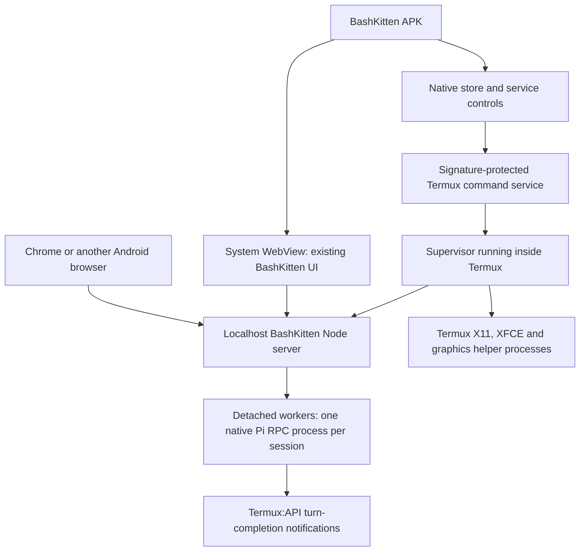

# BashKitten Android and Termux suite: implementation plan

Status: implementation in progress, researched 19–20 September 2026. The `main`
branch supplies the web UI and native Pi adapter, promoted from `codex/pi-termux-rpc`. This
document adds a plan for a portable shared server, the Android host, signed
Termux distribution, APT/npm package maintenance, lifecycle controls and desktop
integration. [Implementation status](suite-implementation-status.md) records the
completed changes and actual checks; requirements below are not blanket claims
that every feature has already been implemented or tested.

## 1. Product and process ownership

Build a Kotlin Android BashKitten app with a system WebView for the existing chat
UI and a native store/control screen. On Android, Termux owns every backend, Pi
and desktop process. The store remains available before Termux is installed and
whenever the web server is stopped. Ordinary Android browsers continue to use
the same authenticated `http://127.0.0.1:3939` application. On Linux, the same
Node server and web UI run directly under the user's account without Termux or
an APK. The diagram below describes the Android deployment of that shared code.



The current transcript renderer, tool/thinking streaming, output styling,
compaction presentation, themes, session naming and project sidebar remain the
UI. Preserve native Pi history and credentials. Narrow screens use collapsible
project and file drawers; wide screens can show projects, chat and files together.
Keep the expandable repository browser in the top bar for Android and ordinary
browser clients. The optional Linux desktop host uses the system file manager
instead of this file panel, as specified in section 10.

WildBuzzard is not a dependency, installation requirement or implementation
target for this work. A future app signed with the suite certificate can request
the same Termux command permission independently.

## 2. Repositories and release ownership

| Repository | Responsibility | Published artifacts |
| --- | --- | --- |
| `openresearchtools/bashkitten` | Shared `src/web/` and `src/server/`, hosts in `src/android/` and `src/linux/`, platform adapters and packaging | BashKitten APK, Termux `aarch64` server `.deb`, Linux `arm64`/`amd64` server and desktop `.deb` packages, source and release metadata |
| Proposed `openresearchtools/termux-suite` | Tracked upstream Termux sources, patch series, build/signing workflows and suite catalog | Termux/add-on APKs, both X11 variants, matched X11 companion `.deb`, complete source archive and signed catalog |
| Existing `openresearchtools/apt` | Final signed APT distribution for Linux `arm64`/`amd64` and native Termux `aarch64` packages | Platform-specific keyring packages and the existing shared signed index referencing application release assets |

### Shared BashKitten source layout

Keep application source under one `src/` tree, with the shared server independent
of Android packaging. Proposed BashKitten layout:

```text
src/
  web/                       # One existing chat/settings/login UI for all hosts
  server/
    http/                    # HTTP(S) routes, auth, event streams and UI serving
    rpc/                     # Native Pi processes, detached workers and sessions
                             # Also Pi ModelRuntime services, login and runtime selection
    files/                   # Folder browsing, uploads, downloads and backend ZIPs
    updates/                 # Pi npm checks, runtime staging and shared job/status types
    platform/
      linux/                 # Linux paths, Pi context template and platform capabilities
      termux/                # Termux paths/context, bootstrap/APT, supervisor, API and X11
  android/                   # Native APK: Gradle, Kotlin/Compose, WebView and store
  linux/                     # Small Python/PyGObject GTK 4 + WebKitGTK desktop host
packaging/termux/             # .deb recipes and installation assets, not copied source
packaging/linux/              # Desktop launcher, icons and host dependency declarations
tests/server/                # Shared server/RPC/files tests
tests/platform/              # Platform integration tests
```

The current `termux/server.mjs`, `rpc.mjs`, `worker.mjs`, `services.mjs`,
`files.mjs`, `folders.mjs`, `web-auth.mjs` and common helpers are mostly shared
server code. Move them to the appropriate `src/server/` areas, splitting out only
the actual platform dependencies. Move the two existing UI HTML files into
`src/web/` and update launch scripts, asset paths, tests and packaging together.
Do not create Android and Linux copies of the UI, HTTP(S) API or Pi controls.
Pi remains an unmodified dependency; `rpc/` contains BashKitten's integration.

Pass a small platform adapter into the shared server for home/data/runtime paths,
allowed working-folder roots, process startup and optional capabilities. On
Termux, the picker remains confined to writable Termux home directories. On
Linux, it defaults to the user's home, with explicitly configured writable
project roots where needed. The tree/picker component and confinement checks
are shared. Browser upload pickers remain separate and use the browser's normal
file input on both platforms.

Termux bootstrap, `pkg`/APT operations, Android notifications and X11 commands
belong in the Termux adapter; APK installation, Android permissions and WebView
callbacks belong in `src/android/`. Shared code uses capability interfaces and
does not require Android classes, a Termux prefix or Termux commands on Linux.
Expose supported controls through those capabilities. Linux also runs the web
application in an ordinary browser; the optional `src/linux/` wrapper adds native
window/file integration without becoming a prerequisite. Do not assume every
Linux distribution uses APT. Keep Pi's short environment context templates in
the platform adapters and their common installation/reload logic in `server/rpc/`.

HTTP(S) transport and any TLS configuration belong in `src/server/http/` on both
platforms. The current listener is loopback HTTP; this layout does not claim
HTTPS is already implemented. Preserve localhost binding, authentication and
Origin/CSRF checks when adding transport options. Source reorganization must
preserve existing session/data locations, credentials and UI behavior.

### Termux suite source layout

Proposed layout in the separate suite repository:

```text
sources/termux-app/
sources/termux-api/
sources/termux-x11/
sources/termux-boot/
sources/termux-widget/
sources/termux-styling/
sources/termux-float/
sources/termux-tasker/
patches/termux-app/series
patches/build-config/...
build/...
catalog/...
licenses/...
upstream.lock.json
.github/workflows/...
```

Import actual files at recorded upstream commits. Expand nested upstream
submodules, including X11 dependencies, so a source download contains their
contents. Keep upstream trees pristine and apply the documented patch series to
a build staging directory. Updating upstream is a source-import commit followed
by explicit patch refreshes; CI fails when a patch no longer applies.

### Upstream build fidelity and license preservation

Build each Termux app from its own pinned official release tag/commit using its
upstream Gradle wrapper, build scripts, modules, bootstrap variant/checksums,
dependency versions and documented build environment. Use that release's workflow
as the reference rather than reconstructing an unrelated Android project. Keep
our workflow as a thin source/patch/build/sign/publish layer. Retain upstream
package IDs, runtime paths, resources and bootstrap/package-management behavior.
Sources: [Termux build configuration](https://github.com/termux/termux-app/blob/master/app/build.gradle)
and [upstream GitHub build workflow](https://github.com/termux/termux-app/blob/master/.github/workflows/debug_build.yml);
implementation must use their equivalents at the locked release commit.

Record every deviation: the small trusted-control/setup patch in section 4,
our signing configuration and necessary production/version/build compatibility
settings. Where an upstream workflow builds a debug artifact, explicitly record
the production signing/non-debuggable adjustment instead of silently inheriting
its test key or changing unrelated behavior. Keep API/add-on behavior unchanged
unless a separately documented compatibility fix is necessary. Preserve upstream
build tools per project; make the already-required 16 KB changes isolated and
reviewable if the selected upstream release does not yet satisfy them.

Preserve all upstream LICENSE/COPYING/NOTICE files, source copyright headers,
license exceptions, third-party notices and existing in-app license displays.
Add a separate suite modification notice identifying the upstream project and
revision, our changes/dates, build revision and source location. Do not replace
upstream attribution with our name or apply the Termux app's license to every
bundled component. Retain existing notice text and add our disclosure to the
source, release metadata and store/About source-license view.

This covers APK libraries, bootstrap archives and any `.deb`/runtime dependency
we redistribute. Record a component manifest with versions, hashes, licenses,
upstream source locations and build/patch inputs. Retain each package's license
payload in the platform-appropriate documentation path. Include required
corresponding source and build material for the exact redistributed versions in
release source artifacts; an app-only tag archive or a notice alone is not a
substitute. Ordinary dependencies installed from upstream Termux repositories
continue to use upstream's packages and metadata; this is not a plan to rebuild
or relabel the entire Termux package repository.

Every released APK must identify its upstream commit, suite revision, build
inputs and matching source artifact. Publish source, patches, build scripts and
required corresponding source for redistributed components, including the
bootstrap where applicable. Do not assume GitHub's automatic tag archive includes
downloaded dependencies. Preserve individual licenses, exceptions, attribution
and modification notices; expose them in the store's source/licenses view.
Termux app identifies its main license as GPLv3-only with exceptions, and X11
also carries GPLv3. See [Termux licensing](https://github.com/termux/termux-app/blob/master/LICENSE.md)
and [X11 licensing](https://github.com/termux/termux-x11/blob/master/LICENSE).

Keep Termux modifications in their licensed projects. BashKitten's own frontend,
Node adapter and planned Android host use **GPL-3.0-only**, matching Termux's
project license. Third-party components retain their own licenses and notices.
Any borrowed implementation must be compatible with GPL-3.0-only and retain its
required attribution; this plan requires no third-party frontend code.

## 3. Signing, Android identity and build configuration

All released APKs use one privately held Android signing identity, including
BashKitten and every Termux add-on. Keep `com.termux`, `com.termux.api`,
`com.termux.x11` and the other upstream add-on IDs. BashKitten's application ID
is **`com.bashkitten`**. Derive its component names and provider authorities from
that ID. The user owns **`bashkitten.com`**; record it as the product domain for
future website/verified-link configuration. The localhost app remains usable
without that domain being configured or reachable.

Preserve Termux's `/data/data/com.termux/files/usr` prefix and its upstream
shared-UID relationship with compatible add-ons. BashKitten has its own UID; it
does not need direct access to Termux's files. Equal certificates alone do not
merge app storage. X11 offers its upstream shared-UID and standalone variants.

Signing procedure:

1. Reuse the **Droid Android signing identity created on 20 September 2026**:
   RSA-4096, alias `droid`, PKCS12 keystore, certificate valid until
   20 September 2126. Its public certificate SHA-256 is
   `2F:6A:2C:EA:E1:A8:0E:98:B3:A1:21:56:D3:7E:7D:C5:54:1C:E0:96:8D:D4:82:85:BC:71:BB:55:57:13:DF:38`.
   Do not generate another key for later repositories or releases.
2. The self-contained local backup is **`/home/user/Documents/droid.txt`**,
   outside Git and readable/writable only by its owner (0600). This single plain
   text file contains the original keystore as base64, an **unencrypted PKCS#8
   private key**, the exact public certificate, alias, all keystore/key passwords,
   fingerprints and reuse instructions. It needs no GitHub access or separate
   backup password. Decode temporary keystore copies only into private working
   directories and remove them after use. Recovery from the saved file, Java
   keystore loading, RSA signing and Android APK v2/v3 signature verification
   have passed using a temporary local signing fixture. The same four signing
   Secrets have now been stored in both implementation repositories. A second offline or encrypted backup is additional;
   it never replaces this usable local file. Never commit it or put its contents
   in logs, release assets or caches.
3. Upload the **same local keystore and credentials** as repository-level GitHub
   Actions Secrets in `openresearchtools/bashkitten` and
   `openresearchtools/termux-suite`. The owner is a personal GitHub account, so
   use a separate encrypted secret copy in each repository rather than
   organization-level secrets. Use consistent names: `ANDROID_KEYSTORE_BASE64`,
   `ANDROID_KEYSTORE_PASSWORD`, `ANDROID_KEY_ALIAS` and `ANDROID_KEY_PASSWORD`.
   Populate them through `gh secret set` using local files/stdin, without putting
   secret values in command arguments or logs. Future suite repositories receive
   the same values from the local backup; never generate another key per repo or
   try to download secret values from GitHub. Each release verifies its APK
   certificate against the common public fingerprint. Extra environment rules,
   release-tag restrictions and manual approval gates are not required for this
   setup. Signing jobs still execute trusted release code, and fork/PR jobs never
   receive production signing material.
4. Pin build tools and Actions revisions. Build and test before the signing job;
   verify every output certificate with `apksigner`. Do not inherit upstream's
   public debug/test signing key. Release APKs are not debuggable.
5. Preserve upstream displayed versions and maintain increasing internal version
   codes as described below, coordinated across the two X11 variants. Document
   signing-key recovery before shipping.

### Termux APK versions and suite revisions

Keep each app's **`versionName` equal to its selected official upstream release**.
Termux, API, X11 and the other add-ons retain their own release sequences; do not
assign BashKitten's version to them. Obtain the effective version from the
upstream release workflow/tag and generated APK metadata, including supported
version overrides, rather than assuming a static Gradle default is authoritative.
For X11 nightlies, retain upstream's version/date/commit identity and pin the
matching companion package.

Track our changes separately as `suiteRevision`, for example a store label
`Termux <upstream version> · suite revision 2`. Put the upstream identity and suite
revision in release asset names, notices and the signed catalog. These identify
our modified, suite-signed distribution while preserving familiar upstream
versioning. BashKitten itself retains its own version sequence.

Keep a checked-in per-package release ledger for **`versionCode`**. On the first
suite build, use the upstream code where valid. For a new suite release, allocate
`max(upstreamVersionCode, previousSuiteVersionCode + 1)` and record the mapping.
This permits another patched build of the same upstream version and still lets
a later upstream release upgrade it. Validate Android's integer limits and the
actual output manifest; an identical reproducibility rerun reuses its recorded
release code instead of allocating another. Both X11 variants share the package
ledger. Store update decisions use the signed catalog and installed version code,
not `versionName` alone. The internal code may therefore differ from upstream
even when the displayed version matches. See [Android versioning](https://developer.android.com/studio/publish/versioning).

Test both a same-upstream-version patch upgrade and an upgrade to the next
upstream release, signed with the suite key. A matching upstream version number
does not make APKs signed with different certificates interchangeable.

Document how others build and install the entire suite with their own signing
key, including the backup/reinstall transition for a different certificate.

The existing APT signing key remains separate. Its public fingerprint is
`94A2 D5BD BD2A 22C1 B6F0 914D C7B3 EFA0 BA41 EB0A`. Use a separate signed-catalog
key for store metadata, pinned in BashKitten, rather than exposing the Android
keystore to routine catalog publishing jobs.

Release Android APKs for the `arm64-v8a` Android ABI and native Termux packages
with `Architecture: aarch64`. Use **aarch64** for the Termux build target, package
filenames, APT metadata and package choices in the UI. Debian's `arm64` package
target is separate and is not used for this Termux distribution. BashKitten's
proposed minimum is Android 12/API 31, with current stable compile/target SDK at release
(API 37 in the current test environment). It needs no native NDK code of its own.
Pin compatible SDK/NDK versions for each upstream app instead of forcing one
Gradle configuration across all projects. Support **both 4 KB and 16 KB devices
with the same APKs and Termux aarch64 packages**. Verify native APK libraries AND
executable Termux packages on both page sizes. Use suitable 16 KB alignment and code that
reads the runtime page size; do not hard-code a 16 KB requirement. Supporting
16 KB pages does not drop 4 KB compatibility. Android documents the alignment
requirements in its [16 KB page-size guide](https://developer.android.com/guide/practices/page-sizes)
and confirms that a correctly adapted binary supports both in its
[compatibility explanation](https://android-developers.googleblog.com/2024/08/adding-16-kb-page-size-to-android.html).

V1 supports installation in the primary Android user with Termux on internal
storage. Do not claim unchanged Termux packages work in secondary profiles with
different private paths; upstream's bootstrap explicitly checks these conditions.

## 4. The small Termux patch

Add a signature-protected command entry point, for example:

```text
permission: com.termux.permission.RUN_TRUSTED_COMMAND
protectionLevel: signature
service: com.termux.app.SuiteRunCommandService
activity: com.termux.app.SuiteSetupActivity
```

BashKitten requests this permission in its manifest. Android grants signature
permissions to apps signed with the declaring app's certificate without a runtime
permission dialog. This is the mechanism for automatic trusted integration.
See [Android permission protection levels](https://developer.android.com/guide/topics/manifest/permission-element).

`SuiteRunCommandService` reuses Termux's existing argument validation, environment,
background task execution and result callback handling. Refactor only the small
policy seam needed to exempt this protected component from `allow-external-apps`.
The existing public `RUN_COMMAND` route keeps its current dangerous permission
and external-app policy. Do not enable external commands globally.

The authorization decision comes from Android's component permission and the
actual service implementation, never a caller-supplied `trusted` extra.
`Binder.getCallingUid()` in `onStartCommand()` is not a reliable substitute for
this because the system delivers the started-service intent. Require explicit
components and narrowly scoped result callbacks; validate input sizes and paths
before executing or writing results. Upstream's present policy check is visible
in [RunCommandService](https://github.com/termux/termux-app/blob/master/app/src/main/java/com/termux/app/RunCommandService.java).

`SuiteSetupActivity` reuses the normal Termux bootstrap installer and exposes
preparing/ready/error status to BashKitten. BashKitten launches it while visible;
the user may briefly see a setup progress window, but never has to enter terminal
commands. This also gives first initialization a proper Android activity
lifecycle. A command service alone cannot assume `$PREFIX` already exists.

Termux:API and the other add-ons retain upstream application behavior. Turn
notifications use the normal Termux:API text notification interface, without a
custom notification-link patch. Build/signing adjustments are recorded separately.

## 5. Installation and actual update behavior

First launch opens the native store with a guided setup flow:

1. Check device ABI, Android version, free space, primary-user compatibility and
   installed package certificates.
2. Ask Android to enable installation from BashKitten when needed, then submit
   verified APKs through `PackageInstaller` and display Android's confirmation.
3. Install Termux and Termux:API. Offer the desktop component with a clear X11
   standalone/shared-UID choice; default desktop setup includes XFCE/LibreOffice.
4. Initialize Termux through the protected setup activity, then run the
   resumable package bootstrap through the protected command service.
5. Start the supervisor/backend, wait for authenticated application readiness,
   and open the existing BashKitten web login/setup page.

An existing Termux installation signed by F-Droid, upstream GitHub or another
publisher cannot be updated in place using our different certificate. Show a
backup/migration flow before any uninstall. Restore home data and reinstall
compatible packages afterward; never silently erase the user's Termux data or
current emulator profile.

The updater checks a signed catalog on a bounded foreground interval and with
periodic WorkManager work. Catalog entries contain package ID, version code,
version name, ABI, minimum/target SDK, APK URL, size, SHA-256, certificate hash,
variant, source commit, release notes and compatibility requirements. Enforce
catalog signature, freshness and rollback checks before trusting assets. Read
actual installed state from PackageManager, using a finite `<queries>` list.

Use `REQUEST_INSTALL_PACKAGES`, `UPDATE_PACKAGES_WITHOUT_USER_ACTION`,
`USER_ACTION_NOT_REQUIRED`, and initial-install update ownership where supported.
Always handle `STATUS_PENDING_USER_ACTION`. Android's unattended-update conditions
include the installer relationship and the updated app's target SDK; Android
16 requires target 34+, and Android 17 requires target 35+.
[PackageInstaller requirements](https://developer.android.com/reference/android/content/pm/PackageInstaller.SessionParams#setRequireUserAction(int)).

**Consequently, fully silent updates of the minimally patched upstream Termux
suite are not a v1 promise.** Termux and Termux:API currently target SDK 28;
X11's shared-UID flavor also targets 28. They do not meet those thresholds.
Keep those targets for compatibility. Modernize the standalone X11 target only
after validating its behavior. BashKitten's modern target allows it to use the
supported self-update path when the other Android conditions are satisfied.
See [Termux build settings](https://github.com/termux/termux-app/blob/master/gradle.properties),
[API build settings](https://github.com/termux/termux-api/blob/master/gradle.properties),
and [X11 flavors](https://github.com/termux/termux-x11/blob/master/lorie-app/build.gradle).

Raising Termux's target is a separate runtime project: Android restricts executing
binaries from writable app-private storage for newer targets. A newer NDK or the
same certificate does not remove this. The Play distribution demonstrates an
alternative with substantial integration changes; adopting it would change the
requested upstream/add-on architecture. See [Android executable restrictions](https://developer.android.com/about/versions/10/behavior-changes-10#execute-permission)
and [Termux Play distribution changes](https://github.com/termux-play-store/termux-apps/releases).

Native APT/backend updates do not require Android APK-install confirmation. APK
checks/downloads can be automatic, and the store can show a ready-to-confirm
update when Android requires it. Schedule Termux and shared-UID add-on upgrades
at an idle boundary because APK replacement can stop related processes. Persist
state, stop managed work gracefully, install, then recover services. Do not claim
the APK installer can preserve every running Pi process during replacement.

## 6. Bootstrap and the existing APT repository

Use the existing Termux keyring:

```text
https://github.com/openresearchtools/apt/releases/download/repo/openresearchtools-termux-keyring.deb
```

After the normal Termux bootstrap exists, install the download/checksum tools
through its authenticated upstream APT source. Download our keyring inside
Termux, verify its hash against the catalog authenticated by BashKitten, then
install it with `dpkg`. Pass the expected hash through the protected command
channel. Its source configuration registers
`https://apt.openresearchtools.com` under the correct Termux prefix. Later
packages are authenticated by APT's signed indexes.

Bootstrap has a persisted step journal, package-manager lock, retry/resume,
download progress, actionable errors and disk-space checks. Reopening the app
resumes unfinished steps. It must not reset user configuration, Pi credentials,
native sessions or existing projects.

| Layer | Installation |
| --- | --- |
| Core | Supported Termux `nodejs-lts` satisfying Node >=22.19, Python, Git (`git`), GitHub CLI (`gh`), ripgrep, fd, termux-api CLI, certificates and archive utilities |
| BashKitten | Native `bashkitten` package containing server, current web UI, supervisor, launchers and pinned unmodified Pi/dependencies |
| Desktop | `x11-repo`, `xfce4`, `dbus`, LibreOffice and required fonts, plus the companion X11 package matching our APK |
| Graphics | Install the dependencies for the selected tested profile; renderer diagnostics remain available in the desktop controls |

Use the package recipe names present at the locked package snapshot; verify
`apt-cache policy` during bootstrap. The current upstream sources contain
`xfce4`, `xfce4-session` and a native [LibreOffice recipe](https://github.com/termux/termux-packages/blob/master/x11-packages/libreoffice/build.sh).
No proot distribution is required for this design. Prepare the core first, then
the requested desktop bundle, with separate visible progress.

Install both `git` and `gh` by default, available in ordinary Termux sessions and
to Pi's tools. Use the native upstream [Git package](https://github.com/termux/termux-packages/blob/master/packages/git/build.sh)
and [GitHub CLI package](https://github.com/termux/termux-packages/blob/master/packages/gh/build.sh).
Installation does not embed a GitHub account or token.

### Short native Pi environment context

Ship a concise base `AGENTS.md` template at
`src/server/platform/termux/pi-context/AGENTS.md`, capped at roughly 200 words.
During bootstrap and after template updates, synchronize it into Pi's global
context file, normally `~/.pi/agent/AGENTS.md`. Resolve the effective agent
directory through the selected Pi runtime, including `PI_CODING_AGENT_DIR`, and
render paths from the real environment. This is separate from BashKitten's own
repository `AGENTS.md`; do not copy development instructions into the user's Pi.

Use an identifiable, versioned managed block; atomically replace only that block
and preserve personal instructions outside it. Keep a backup before the first
change, make repeat setup idempotent and never rewrite project context files.
Preserve previously effective global instructions when Pi's alternate filenames
are present: creating `AGENTS.md` must not hide an existing `CLAUDE.md`, and an
existing `AGENTS.override.md` needs the managed block in the effective file too.
Do not change Pi's precedence rules or replace its native system prompt.

Draft Termux block, with placeholders expanded by the installer:

```markdown
## Termux environment

- You run inside unrooted Android Termux, using Bionic and native aarch64
  packages. Debian arm64/glibc binaries are not interchangeable. Do not assume
  sudo, systemd, /usr or a conventional Linux filesystem.
- Home: {{HOME}}. Package prefix: {{PREFIX}}. Work in the selected project or
  writable home directories; other Android apps' private data is inaccessible.
- Find packages with `pkg search NAME`; install with `pkg install NAME`.
  `pkg update` refreshes repository metadata; `pkg upgrade` refreshes and upgrades
  installed packages. Use Termux repositories and respect package-manager locks.
- Global skills: {{PI_AGENT_DIR}}/skills/ and ~/.agents/skills/. Trusted projects
  can provide .pi/skills/ or .agents/skills/. Read the relevant SKILL.md when its
  task applies, then any needed references; do not preload every skill body.
- Package help: https://wiki.termux.com/wiki/Package_Management
  Available package recipes: https://github.com/termux/termux-packages
```

Keep package inventories, desktop/GPU recipes and full skills out of this block.
Pi's own skill discovery provides names/descriptions and loads full skill content
on demand; respect native project trust and user skill settings. Documented
sources: [Pi context files](https://github.com/earendil-works/pi/blob/v0.85.1/packages/coding-agent/docs/usage.md#context-files)
and [Pi skills](https://github.com/earendil-works/pi/blob/v0.85.1/packages/coding-agent/docs/skills.md).

Synchronize before launching Pi, and track the context version loaded by each
worker. An update during a turn takes effect at the next safe idle boundary:
checkpoint the session/queues and gracefully restart only that Pi subprocess
against the same native session to reload context. Do not interrupt a turn or
replay queued messages. No Pi source change or invented RPC `reload` command is
required. Show pending/applied status if an update is waiting on active work.

Provide a smaller Linux template under
`src/server/platform/linux/pi-context/AGENTS.md`, using the same managed-block
mechanism and excluding Termux-specific guidance:

```markdown
## Linux environment

Home: {{HOME}}. Work in the selected project as the current user. Check
/etc/os-release and available tools before choosing distribution-specific
package commands; do not assume root or sudo access. Global skills are in
{{PI_AGENT_DIR}}/skills/ and ~/.agents/skills/; trusted projects may add
.pi/skills/ or .agents/skills/. Read relevant SKILL.md files on demand.
```

### Telemetry defaults

Apply telemetry-off defaults before the first Pi or GitHub CLI launch. Persist
them in an owned Termux environment/profile file, preserving existing user files,
and explicitly apply them to the supervisor, background services, login helper,
Pi workers and terminal launchers; background execution must not depend on an
interactive shell sourcing its profile:

```text
PI_TELEMETRY=0
PI_OFFLINE=1
GH_TELEMETRY=0
DO_NOT_TRACK=1
GH_NO_UPDATE_NOTIFIER=1
GH_NO_EXTENSION_UPDATE_NOTIFIER=1
```

Also retain Pi's RPC `--offline` flag and merge `enableInstallTelemetry: false`
into Pi's native settings without overwriting unrelated settings. The pinned Pi
release supports these controls; see its [telemetry implementation](https://github.com/earendil-works/pi/blob/v0.85.1/packages/coding-agent/src/core/telemetry.ts)
and [CLI options](https://github.com/earendil-works/pi/blob/v0.85.1/packages/coding-agent/src/cli/args.ts).
GitHub CLI documents its [telemetry and update-check environment settings](https://cli.github.com/manual/gh_help_environment).

BashKitten, Termux and the shipped add-ons must have analytics and automatic
crash-report uploads absent or disabled. Audit the pinned sources and apply actual
supported settings/build options; do not assume a generic environment variable
controls every app. Repeat the audit when upgrading components. Verify network
behavior during startup, idle operation and first use. Explicit model/provider
requests, Git/GitHub actions, package downloads and the requested store update
checks still work; disabling telemetry does not disable those functions.

Publish `bashkitten_VERSION_aarch64.deb` from the BashKitten release, alongside
the Linux artifacts described in section 10 when releasing those targets. Add
`openresearchtools/bashkitten` with glob `bashkitten*.deb` to the existing APT
`packages.json`, covering the server and Linux desktop packages. Validate each
asset's actual package name, architecture and version before publication.
Dispatch the existing `package-released` workflow after publishing; retain the
repository's scheduled refresh as recovery. **Our existing APT repository is the
final installation/update channel for these `.deb` packages.** GitHub Releases
hold immutable binary/source assets used by its existing signed index; Actions
artifacts are for pre-release testing. APKs remain in GitHub Releases and the
signed app catalog, installed through Android's package installer.

The Termux package is `aarch64`, despite much of its content being JavaScript: it uses
Termux/Bionic dependencies and paths. Do not publish it as a Debian `arm64` build
or a generic cross-platform `all` package. Build/select native npm dependencies
for Android/Bionic and validate them in real Termux; a Debian/Ubuntu `arm64` build
is not a Termux `aarch64` build. Ship the pinned production dependency graph,
without a network-dependent `npm install` in package-maintainer scripts. Pi remains the ordinary upstream
package, currently pinned to 0.85.1 in this branch.

Install `bashkitten-web`, `bashkittenctl` and a launcher for the same managed Pi
runtime, initially supplied by the package. Expose `pi` for terminal use where
it is unoccupied; detect any existing global Pi installation rather than
overwriting it. Both the UI and BashKitten's launcher resolve the same selected,
exactly pinned runtime. An unrelated global npm installation is not the version
reported as BashKitten's Pi.

Retain data at the current `~/.local/share/bashkitten-pi` location and credentials
in Pi's native location. Stage immutable runtime versions in package-managed
payloads and retain active runtime copies under `$PREFIX/var/lib/bashkitten`.
Switch the active launcher only after verification; old workers keep their
runtime until exit, and are retained after exit. Account
for dpkg removing old package files: merely naming package directories with
versions does not preserve them across upgrades. Runtime/Node upgrades requiring
process replacement wait for an idle boundary, with backups before migrations.

Build X11's companion `.deb` from the same commit as both APK variants. Publish
it from the suite release and index it through APT with a precise asset glob.
Use an explicitly named suite companion package with appropriate upstream
package conflicts/provides, and a manifest mapping APK commit to companion
version. Do not mix an arbitrary `termux-x11-nightly` update with a separately
pinned APK. Source: [X11 build and companion packaging](https://github.com/termux/termux-x11/blob/master/lorie-app/build.gradle).

### Pi npm update checks and runtime selection

Package maintenance checks **both APT packages and Pi's npm release**. Read the
installed Pi version from the runtime actually selected by `src/server/rpc/`,
including the version used by existing workers. Query the configured npm registry
for `@earendil-works/pi-coding-agent` release metadata and its dependencies; for
example, `npm view @earendil-works/pi-coding-agent@latest version engines dependencies dist.integrity --json`.
Use semantic version comparison and show installed, latest upstream and latest
compatible versions separately when they differ. Do not equate a package lock's
allowed version with the latest upstream release. See npm's documented
[registry metadata command](https://docs.npmjs.com/cli/v11/commands/npm-view/)
and [installed/wanted/latest distinction](https://docs.npmjs.com/cli/v11/commands/npm-outdated/).

The common update check refreshes APK catalog, APT and npm status independently,
with per-source timestamps and errors. A failed or offline npm check must not
display Pi as up to date or prevent APT/APK checks. Read-only checks never change
the installed runtime. Keep Pi's own startup catalog traffic and telemetry off;
these are explicit BashKitten package checks, also available on Linux without APT.

**Update packages** checks APT, installed global npm packages, and Pi's current
npm release. Show package names with installed/available versions. Node/npm files
owned by APT are updated through APT, not overwritten by a global npm install.

Pi updates use npm directly; no separately published compatibility manifest is
required. Check the upstream Node requirement, install the exact discovered Pi
version and matching pi-ai into a separate runtime, retain npm's dependency lock,
and validate the native API before selecting it. Active turns and provider logins
finish before activation. A failed installation leaves the current Pi selected.
The launcher, RPC and service login use the same selected native runtime.

### Package update jobs and progress

On Termux, package updates are a supervisor-owned operation with a durable job
ID, status and bounded output log. The **Update packages** action refreshes APT
and Pi npm metadata, resolves compatible updates, applies the APT transaction,
then reconciles/stages any remaining Pi runtime update using the rules above.
Show the two stages separately and retain each result if only one succeeds.
Termux's `pkg update` refreshes metadata only; `pkg upgrade` runs
`apt update` followed by `apt full-upgrade`. Use those native semantics, retaining
APT signature checks, dependency resolution and dpkg ownership.
[Termux package-manager implementation](https://github.com/termux/termux-tools/blob/master/scripts/pkg.in).

For integration, run the equivalent APT operations with native progress/status
streams where available and capture stdout/stderr as a fallback. Publish ordered
events for repository refresh, package downloads, unpacking, configuration and
completion/failure. Show available byte counts, percentages and package names;
use an indeterminate indicator when the tool provides no measurable progress.
Preserve normal package-manager messages in an expandable plain-text log.

Only one package transaction runs at a time, using the real APT/dpkg locks as
well as the supervisor's job lock. The job continues if the screen closes and
can be observed through native Termux control even if the HTTP server restarts.
Graphics-profile changes and Pi runtime installation use this same queue and
progress protocol; bootstrap, Update packages, Update Pi and profile switching
cannot run competing operations. npm work does not pretend to hold a dpkg lock,
but shares the supervisor lock so Node/APT upgrades cannot race runtime staging.
Respect the runtime idle-boundary and paired-X11 rules above, showing any waiting
reason. Preserve modified configuration by default and surface decisions that
need user input in the UI. Cancellation must not force-kill dpkg while it is
unpacking/configuring; finish that transaction safely. Record interrupted jobs
accurately and expose package-manager recovery through the same UI.

## 7. Native menu, app store and update window

The compact hamburger beside BashKitten opens a menu. **Apps** is one menu item
and opens a separate, professionally laid-out store screen. It does not toggle a
single long page containing store, packages, services and chat controls.

The store has real application icons, titles, short descriptions, installed and
available versions, and Install / Installing / Installed / Update / Retry states.
Use required, desktop and optional sections, pull to refresh and a refresh button.
Release notes and source/license links belong in each app's details. X11 has the
standalone/shared-UID selector. The current selected installed graphics profile
gets one tick, as specified in section 9.

A compact **Package updates** card near the store's top opens a separate update
screen. The menu also links directly to it. Show APT and npm package lists,
including the Pi runtime, and Check updates / Update all actions. Updating shows
a progress window with the current phase, actual package names, downloads,
unpacking/configuration and npm installation output. Reopening follows the same
job. Unknown/disconnected status must never label an installed Pi as missing.

The menu provides compact server start/stop status and links to Desktop and Pi
session controls. Desktop controls retain remembered commands, graphics choices
and play/stop; Pi controls retain per-session stop/kill and stop all.

Back from every native screen returns to the existing loaded chat. Keep the
WebView attached and preserve its document, selected session, unsent draft and
cookies. Opening or closing these screens does not stop services or reload chat.

BashKitten never uninstalls applications. Changing X11 shared-UID membership
requires manual removal through Android settings. Emulator migration tests do
that outside BashKitten on the disposable test device.

## 8. Supervisor, recovery and Pi lifecycle

On Android, run `bashkitten-suite-manager` as a long-lived task owned by Termux's
existing service. Its Termux adapter manages the shared HTTP(S) server child,
desktop process groups and state, while detached workers in `src/server/rpc/`
continue to own Pi RPC on both platforms. It has a private local control socket
and a CLI that returns versioned JSON status/results. Linux launches the same
server/worker code using its platform adapter, without the Android command bridge.

While BashKitten is visible, its native controller uses the protected Termux
command component to run `bashkittenctl status/start/...`. This route works when
the web server is down and does not require access to Termux's private files.
Use fixed command entry points and bounded structured arguments. Keep a
single-instance lock, readiness probes, restart backoff and request IDs so
repeated lifecycle callbacks cannot start duplicate servers.

On launch/resume, initialize Termux if needed, ensure the manager exists, and
start the backend if it died unexpectedly. Closing the WebView, swiping away
BashKitten, or closing a browser does not send a stop command. A deliberate Stop
action sets a persisted desired state, so status polling does not immediately
undo it. An explicit Play clears that state.

Do not describe the manager as immortal: Android can kill or force-stop Termux.
Reopening BashKitten initiates the foreground recovery path. An optional Boot
add-on can request restart after reboot, subject to Android restrictions and the
user's settings. Battery settings are guided UI actions when necessary, not
permissions granted by our certificate.

Pi controls preserve native sessions. Stop turn maps to native abort. Stop
instance aborts as necessary and shuts down its worker. Force kill targets the
recorded owned process group after a timeout; it never uses broad `pkill node`
or kills independently launched terminal Pi sessions. Preserve pending drafts
with explicit delivery state and never auto-replay consumed prompts after a
crash. Mark intentionally stopped instances so reconnect/status does not restart
them. Starting again reopens their existing native session.

Add a user-editable Termux environment note through Pi's supported configuration
mechanism, preserving existing files: explain Bionic, `$PREFIX`, `pkg`, available
desktop commands and home paths. Do not modify Pi or claim a full glibc Linux
environment. A reference to optional skills can use ordinary Pi skill discovery.

## 9. Desktop commands and GPU profiles

Keep two independent selections: **startup method** and **graphics profile**.
Persist display number, DPI, compatibility switches and custom profiles. This
avoids dozens of nearly identical dropdown entries. Defaults are XFCE with D-Bus
and a tested baseline renderer. Advanced users can add a named custom command;
show its resolved command before saving, and run it only on their explicit Start.

The baseline upstream command is:

```sh
termux-x11 :1 -xstartup "dbus-launch --exit-with-session xfce4-session"
```

Offer equivalent upstream launch methods using the `--` command separator,
separate server/session startup with `DISPLAY=:1`, and `TERMUX_X11_XSTARTUP`.
Include a no-D-Bus fallback. Expose `-legacy-drawing`, `-force-bgra` and DPI as
independent settings, plus X11's preferences screen. These options come from
the [upstream X11 usage guide](https://github.com/termux/termux-x11#running-graphical-applications).

| Graphics profile | Intended route | Qualification |
| --- | --- | --- |
| Baseline/software | Native X11/XFCE; explicit Mesa llvmpipe option for GL clients | Must start on the supported emulator and hardware baseline |
| Adreno: Turnip + Zink | Mesa Freedreno Vulkan ICD on supported KGSL hardware; Zink for desktop OpenGL | Probe the actual GPU/driver and validate `vulkaninfo` and `glxinfo`, then a rendered application |
| VirGL: Android GLES | `virgl_test_server_android` plus Mesa `virpipe` clients | Validate the packaged Android GLES path and a rendered workload |
| VirGL: ANGLE/GLES | `virgl_test_server_android --angle-gl` plus `virpipe` clients | Alternative GLES translation route; check device-specific failures |
| VirGL: ANGLE/Vulkan | `virgl_test_server_android --angle-vulkan` plus `virpipe` clients | Candidate for compatible Pixel/Mali and other GPUs; retain a GLES/software fallback |
| Custom | User's saved command/environment | User-triggered; separate from trusted built-in profiles |

Selecting a built-in graphics profile also prepares its package requirements.
Each versioned profile declares its required packages, supported versions,
conflicting alternatives, command and environment. Use prebuilt native Termux
packages. For example, `vulkan-loader-generic` and `vulkan-loader-android` are
conflicting alternatives, and the Freedreno package requires the generic loader.
See [the loader's conflict declaration](https://github.com/termux/termux-packages/blob/master/packages/vulkan-loader-generic/build.sh).

The selection flow is idempotent:

1. Read the actual installed package names, versions and configuration state using
   `dpkg-query`/APT. Compare them with the selected profile's requirements and
   remember the requested selection. A stored boolean alone is not evidence that
   packages are still installed.
2. If the required compatible packages are already configured, perform no
   reinstall, removal or upgrade. Confirm readiness, save the selection and show
   **✓** beside that profile. Coexisting profiles that only change launch flags
   need no package transaction. Package upgrades belong to Update packages unless
   this profile actually requires a newer version.
3. Otherwise resolve and simulate the complete install/removal transaction through
   APT, then submit it to the shared package-job queue. Install missing requirements
   and remove only conflicting alternatives that must be replaced. Let APT account
   for their dependent packages; never force-remove with `dpkg --force-depends`,
   delete libraries manually, or run blanket autoremove. If the solution would
   remove unrelated user applications or required suite components, surface that
   conflict instead of silently removing them. Keep reusable nonconflicting
   graphics packages installed when changing profiles.
4. Download required replacements before removal where the package manager permits,
   then stream the real removal/install/configuration phases to the dropdown and
   its compact progress area. Reuse the top package block's job details. Repeated
   taps, reconnection and app restart attach to the existing job; they never start
   another copy. Prevent competing selections while a transaction is applying.
5. After success, query the package state again and verify the profile's commands.
   Persist the confirmed selection and installed versions, then show the checkmark.
   Only show the tick when its package requirements and readiness checks pass.
   Existing hardware qualification checks still determine whether a GPU profile
   is supported.

Use visible profile states **Checking**, **Waiting**, **Downloading**,
**Removing…**, **Installing…**, **Configuring…**, **✓** and **Failed · Retry**,
following the actual job stages. Show the current package name and expandable
output. The single tick means **this is the current selected profile, installed
and validated as ready to use**. Nonselected profiles never get a tick merely
because their dependencies are also installed. Do not add separate selected and
installed checkmarks or require explanatory status text beside the successful
selection; supply an accessible label for the icon.

While a new choice is being prepared, show its spinner/progress and move the tick
only after success. The old profile may keep its tick only while it remains the
confirmed, usable selection; clear it if a package replacement invalidates that
state. On failure, never show a success tick for the new choice. Keep package
availability for other profiles internally so switching does not reinstall them.
Revalidate on app launch and after package transactions, including changes made
in a terminal, without reinstalling healthy packages. The tick describes readiness
of the selected profile; the separate desktop Running/Stopped control shows
whether its session is currently executing.

Keep requested, confirmed and currently running profiles distinct. Selecting an
option prepares it and remembers which command Play will use; it does not launch
the desktop. If replacement would affect an active desktop or other managed
process, show **Waiting for desktop stop/restart** and apply at that safe boundary.
Do not close desktop applications merely because a dropdown changed. On failure,
retain the error and transaction journal, inspect the resulting package state,
and offer Retry or recovery to the previous profile. Do not claim the old profile
is still ready if its dependencies were already removed. Switching back restores
missing/conflicting packages through APT only when needed. For a custom command,
only manage dependencies explicitly declared by the user; never guess removals
from arbitrary shell text.

Current Termux Mesa builds include Zink and VirGL, and the official
`mesa-vulkan-icd-freedreno` package exists. Prefer those maintained packages over
old recipes that blindly add unrelated repositories or replace system libraries.
See [Mesa build configuration](https://github.com/termux/termux-packages/blob/master/packages/mesa/build.sh)
and [Freedreno package](https://github.com/termux/termux-packages/blob/master/packages/mesa/mesa-vulkan-icd-freedreno.subpackage.sh).

Implement each hardware profile against pinned package versions. Resolve ICD
paths from the installed package; restrict `VK_ICD_FILENAMES`, `GALLIUM_DRIVER`,
`LD_LIBRARY_PATH` and related variables to its subprocesses. Start a private
VirGL server with the matching client socket/environment where supported. Do not
globally rewrite `.bashrc`, replace Vulkan libraries outside the managed APT
transaction, disable SELinux or require root. Version-override flags are
compatibility options, not proof of GPU support.

The current package patch explicitly supplies `--angle-gl`, `--angle-vulkan`
and `--socket-path`; EGL/GLES initialization is already enabled internally.
Do not pass the removed `--use-egl-surfaceless`/`--use-gles` flags to this Android
variant. Validate these flags again against the release's actual binary.
See the [Termux VirGL command-line patch](https://github.com/termux/termux-packages/blob/master/packages/virglrenderer-android/0007-Ensure-EGL-GLES-ANGLE-help-and-socket-path.patch.beforehostbuild).
The current
[virglrenderer-android recipe](https://github.com/termux/termux-packages/blob/master/packages/virglrenderer-android/build.sh)
depends on ANGLE; the [Pixel 9 ANGLE/GLES report](https://github.com/termux/termux-packages/issues/23042)
documents a concrete failure. The [upstream rendering discussion](https://github.com/termux/termux-packages/discussions/16420)
explains the different routes and their overhead. These support exposing tested
choices, not a universal "Pixel acceleration" switch.

The manager tracks its X server, XFCE, D-Bus and optional renderer helper groups.
Starting opens the X11 Android activity; opening a viewer alone reconnects to an
existing desktop. Closing the viewer leaves the desktop running. Stop desktop
terminates those managed processes and clearly signals that desktop applications
will close. It does not stop Pi or the chat backend. If audio is included, use
local authenticated/private transport and expose its state separately.

## 10. Browser behavior, files and provider login

### Android WebView and ordinary browsers

The WebView loads the same server-delivered UI and preserves its cookie store
across launches and APK updates. Flush cookies when appropriate; do not clear
them during routine lifecycle events. Chrome has a separate cookie jar, so it
can retain its own login, but it does not automatically inherit WebView cookies.

Use the ordinary WebView file-chooser callback to delegate uploads to Android's
system picker, including multiple files and image MIME types. Read the returned
URI streams with their granted access. Preserve HTML file inputs, clipboard image
paste and Pi's native image content blocks. No custom storage browser replaces
the system upload picker, and no broad Android storage permission is required.
[WebView file-chooser API](https://developer.android.com/reference/android/webkit/WebChromeClient#onShowFileChooser(android.webkit.WebView,%20android.webkit.ValueCallback%3Candroid.net.Uri%5B%5D%3E,%20android.webkit.WebChromeClient.FileChooserParams)).

Keep repository browsing and folder selection in the shared server/UI, with
roots supplied by the platform adapter. On Termux, show only writable/readable/
searchable home directories: `~` and `~/project`, with no navigation above home.
On Linux, show the user's home and any explicitly configured accessible project
roots, enforcing the same path/symlink confinement. Termux serves files from its
own permissions; the Android picker is only choosing files to upload. Do not add
a Termux shared-storage mount or ask users to grant access to `/data/data`.

In Chrome, downloads/open continue to follow normal browser behavior. In WebView,
handle download callbacks by streaming the authenticated response to Android
Downloads through the platform APIs, or an explicit Save As destination. Preserve
the session cookies for the local HTTP request. For opening a downloaded file,
hand an appropriate `content://` URI to Android's normal Open With flow. Stream
large files and backend-generated repository ZIPs without loading them into JS
or APK memory. Downloading a ZIP includes the whole repository under the existing
safe-link rules; no frontend ZIP implementation is introduced.

Provider login remains owned by unmodified Pi. Its RPC protocol has no login
command, so retain the current public `ModelRuntime.login` adapter and native
credential store. Obtain Pi's authorization URL in the authenticated UI, then
open that URL in the user's external Android browser. Pi receives its own
loopback callback inside Termux. On Linux, the same shared login adapter uses
the normal browser and Pi's local callback, with no Android dependency. Do not
open an authenticated localhost helper in a different browser and assume it
shares WebView cookies. Preserve Pi's
device-code and API-key methods and refresh Services on return; no terminal
login is required. Sources are pinned in [the existing runtime document](pi-termux.md).

Expose only a narrow origin-checked main-frame bridge for actions such as opening
the native store. Repository HTML, OAuth pages and arbitrary frames must never
receive a native command/install interface. Keep the existing account, HttpOnly
cookies, Origin/CSRF protection and localhost-only bind. Android describes the
relevant risks in [WebView native bridges](https://developer.android.com/privacy-and-security/risks/insecure-webview-native-bridges).

### Lightweight Linux desktop host

Use a small **Python/PyGObject, GTK 4 and WebKitGTK 6.0** application in
`src/linux/`. It loads the same localhost URL and existing `src/web/` assets.
The host handles its window, server attachment and desktop integration; all
chat, authentication and Pi logic remains in the shared Node server. Use the
distribution's maintained WebKitGTK runtime, without Electron or a bundled
Chromium engine. Keep GTK/WebKit dependencies out of browser-only server installs.
Sources: [PyGObject](https://pygobject.gnome.org/) and
[WebKitGTK 6.0 API](https://webkitgtk.org/reference/webkitgtk/stable/).

On launch, attach to the existing BashKitten server for this user/profile, or
start the shared server with the Linux adapter and wait for readiness. Use a
single-instance lock and verified local control connection so reopening does not
start duplicate servers or attach to an unrelated process occupying the port.
Closing the window leaves the server and active Pi turns running, matching the
Android lifecycle. Explicit server/Pi stop controls remain available; an explicit
stop is respected until the user starts the service again. Reopening recovers an
unexpectedly dead server. A small native Start/Retry surface remains usable while
the server is down. The shell is a local host; remote browser clients keep the
ordinary web behavior.

Give the host a persistent WebKit network session with private data/cache paths
under the user's XDG directories and explicitly configure persistent cookie
storage. Retain BashKitten's expiring persistent login cookie across window
restarts and host updates; clear it on logout as usual. Keep a stable server
origin and preserve server-side sessions. Do not share or copy the user's
external browser cookies. See WebKit's [network sessions](https://webkitgtk.org/reference/webkitgtk/stable/class.NetworkSession.html)
and [persistent cookie storage](https://webkitgtk.org/reference/webkitgtk/stable/method.CookieManager.set_persistent_storage.html).

Use a small host-capability adapter in the shared UI instead of forking its
renderer or scattering operating-system checks. Select the desktop presentation
only for the native Linux host; it must not globally change another browser
connected to the same server. Presentation flags do not grant native privileges.

| Behavior | Android app / ordinary browser | Native Linux host |
| --- | --- | --- |
| Projects and chats sidebar | Existing UI | Same UI |
| Repository file panel, including top-bar expandable tree | Existing browse/upload/download/ZIP controls | Hidden; replace with compact **Open project folder** action |
| Select a working directory | Shared server folder picker with platform roots | Native folder chooser; pass selection to the same backend validation |
| Attach/upload files and images | Browser/system file picker, paste and drag/drop | Same HTML file inputs and Pi attachment handling through WebKit's native chooser; preserve paste and drag/drop |
| Click a local file/artifact link | Browser or Android download/open behavior | Open the existing local file in its associated application |
| Click an external URL or provider login | External browser where the host provides it | Default system browser; internal chat navigation stays inside BashKitten |
| Repository download / ZIP | Backend ZIP and normal browser download | Hidden; project files are already available through the file manager |

For working-directory selection, return a native absolute path and explicitly
register a user-selected project root if it lies outside the default home root.
Continue checking permissions and symlink confinement on the backend. If the
native chooser is unavailable, the existing shared picker remains a fallback.
Hiding the file panel must not remove chat attachment controls or the project/
thread sidebar. WebKit exposes the HTML upload request through
[FileChooserRequest](https://webkitgtk.org/reference/webkitgtk/stable/class.FileChooserRequest.html).

Implement **Open project folder**, **Open file** and external-link actions as a
narrow native bridge available only to the trusted BashKitten main frame and
invoked by a user action. Resolve session/attachment IDs and relative file paths
against validated project or attachment roots. The host opens that actual file,
including uploaded attachments saved by the server, rather than downloading a
second copy. For an inline image or attachment that exists only as bytes/base64,
have the backend materialize a file once in its attachment cache and open that
path; do not send a WebView-only blob URL to an external application.
Keep arbitrary repository HTML and remote pages outside the bridge.
Use [Gtk.FileLauncher](https://docs.gtk.org/gtk4/class.FileLauncher.html) and the
system URI launcher for default applications/file managers, passing paths as
data. File launches are document-open requests, never shell commands.

Route clicked external links and new-window requests to the default browser;
keep provider callbacks with Pi's existing localhost login flow. Do not navigate
the embedded app into provider or arbitrary external pages. The external browser
handles remote downloads with its own login state. There is no custom Linux
download manager: existing local artifacts open directly, and any export that
must generate a new file is written by the backend to an explicit local
destination before opening/revealing it. Android and ordinary-browser download
endpoints retain their existing behavior.

Distribute a desktop entry/icon and declare Python, PyGObject, GTK and WebKitGTK
runtime dependencies in Linux packaging. Keep this host small and test against
the chosen supported distribution versions on both Wayland and X11. The system
web engine still has a runtime memory cost; measure the host plus Node/Pi and
WebKit processes instead of promising a footprint from shell size alone.

### Linux arm64/amd64 builds and final APT delivery

Build and publish **both Linux `arm64` and `amd64`** from the same release source
and dependency locks. These are Debian/Ubuntu Linux targets, separate from the
Termux/Bionic `aarch64` target even when the CPU is from the same architecture
family. Use an architecture matrix with native ARM64 and AMD64 builders where
available; compile/select each native dependency for its target and supported
distribution baseline. Do not reuse Termux binaries in a Linux package or relabel
one architecture's `.deb` as another.

Keep `bashkitten` as the server/Pi runtime package and `bashkitten-desktop` as the
small Linux host package, depending on the matching `bashkitten` version. This
allows server-only installs without GTK/WebKit dependencies. Build the desktop
package for each Linux architecture too: its host dependency constraints are
Linux-specific even though its own wrapper is Python. Do not mark either package
as a cross-platform `Architecture: all` artifact in the shared APT index.

| Target | Server package | Desktop host package |
| --- | --- | --- |
| Linux `arm64` | `bashkitten_VERSION_arm64.deb` | `bashkitten-desktop_VERSION_arm64.deb` |
| Linux `amd64` | `bashkitten_VERSION_amd64.deb` | `bashkitten-desktop_VERSION_amd64.deb` |
| Termux `aarch64` | `bashkitten_VERSION_aarch64.deb` | Android APK; no GTK host package |

Use normal Linux package paths and dependencies for the first two rows, preserving
per-user Pi credentials/sessions and BashKitten data on install/upgrade/removal.
Keep the Termux prefix and dependency names confined to the third row. Record
and test minimum Node, Python, GTK/WebKit and native library versions for each
supported Linux distribution; avoid tying release binaries to newer libraries
available only on the developer machine.

The current development machine is a native ARM test target: `uname -m` reports
`aarch64` and `dpkg --print-architecture` reports `arm64`. Use it for real Linux
ARM64 host/Pi/browser testing, plus a disposable matching environment for package
install/upgrade/removal tests. AMD64 gets its own native CI/runtime tests, including
desktop integration; an ARM64 pass is not an AMD64 validation. Both architectures
must pass the same shared-server suite and relevant host checks before a Linux
release is published.

Publish tested `.deb` files and matching source/license artifacts to the
BashKitten GitHub Release, then update the **existing `openresearchtools/apt`
catalog at `https://apt.openresearchtools.com`** through section 6's workflow.
The current publisher already accepts `arm64`, `amd64` and `aarch64` in one signed
flat index; preserve that design and let package architecture/dependencies select
the correct target. Linux users use the existing Debian archive keyring package;
Termux users use the existing Termux keyring. After repository setup, Linux users
install the full app with `apt install bashkitten-desktop` and receive subsequent
package upgrades through APT. Use the APT signing identity for repository metadata;
the Droid Android signing key remains for APKs.

First test candidate packages from build artifacts or a prerelease. The current
APT publisher excludes drafts/prereleases, so only promote tested immutable
assets to a normal release and trigger indexing when ready. Verify candidates
and an actual repository install/upgrade for both Linux architectures after
indexing. Keep the companion X11 `.deb` on the same existing Termux APT path;
APKs continue through the signed app catalog rather than APT.

## 11. Termux-only turn notifications

Add a platform notification hook to the shared detached worker, triggered at a
settled Pi turn with a final assistant message. The Termux implementation lives
under `src/server/platform/termux/`. It must work while the HTTP server or UI is
closed. Persist a small deduplicated outbox keyed by session and turn ID so
reconnection does not produce duplicate notifications.

Notifications use unmodified Termux:API. There is no custom notification action
or API patch; completion title and preview are delivered through its normal CLI.

When enabled on Termux, deliver through the installed `termux-notification` CLI
and Termux:API. Use the chat name as title and a configurable, Unicode-safe text
preview, initially capped around 240 characters. This is a product limit; Android
does not provide one universal visible-character limit across notification
layouts. Pass text as data, never interpolate model output into a shell command.

Settings: off/on, optionally only when the relevant chat is not visible, and
preview enabled/hidden on the lock screen. Foreground suppression uses an expiring
UI heartbeat so a disconnected browser cannot suppress notifications forever.
Posting notifications does not need notification-listener access to read other
apps' notifications. Camera, microphone, contacts and location permissions stay
unrequested/denied for this feature. Android's notification permission remains a
normal user-controlled OS setting. Desktop web deployments disable this adapter.

## 12. Implementation order and acceptance gates

| Phase | Deliverable | Required evidence before moving on |
| --- | --- | --- |
| 0. Shared source and platform boundaries | One `src/web/`, shared `src/server/` with Pi controls in `rpc/`, thin Linux/Termux adapters and native APK source under `src/android/` | Same UI/RPC fixtures run on Linux and Termux; Linux starts without Android components; folder roots adapt correctly; source moves preserve sessions, credentials and rendering |
| 1. Source and signed IPC | Suite sources/locks, upstream-based build recipes, tiny Termux patch, notices, test APKs and a minimal BashKitten native controller | Matching certificate can initialize and run a command without manual Termux configuration; a differently signed test app is denied; upstream versions and all build deviations are recorded |
| 2. Installation and packaging | Native store, certificate checks, keyring bootstrap, native `.deb`, APT indexing, Git/GitHub CLI, short Pi environment context and telemetry-off defaults | Fresh setup reaches the localhost UI; `git` and `gh` work; correct global context loads without losing personal instructions; template refresh waits for idle and preserves sessions/queues; telemetry opt-outs apply to terminal and background launches; interrupted setup resumes |
| 3. Runtime lifecycle | Supervisor, backend controls, Pi stop/kill and recovery | Closing APK/browser preserves a real turn; backend restart preserves workers; no duplicate server or prompt replay; deliberate stops stay stopped |
| 4. Browser integration | Persistent WebView, picker/paste/download/open/OAuth behavior | Same chat and files work in APK and Chrome; uploads use the real Android picker; provider callback returns to native Pi |
| 5. Desktop | Both X11 builds, matching companion, XFCE/LibreOffice, profiles/custom commands and dependency switching | Start/stop and variant migration work; selecting a ready profile never reinstalls; conflicting-package swaps show real progress and recover from failure; reopen/repeated selection creates no duplicate job; each GPU claim has rendered evidence |
| 6. Notifications and updates | Worker notifications, signed catalog, APK/APT/Pi npm update orchestration and top package-progress block | One notification per turn; correct session opens; APK update paths work; Pi and installed npm updates are detected even with no APT changes; staged Pi updates preserve active workers; progress survives UI closure/backend restart and exposes per-source errors/recovery |
| 6L. Linux host and packages | GTK/WebKitGTK wrapper, persistent profile, server attachment, native file/link actions and `arm64`/`amd64` server/desktop `.deb` builds | ARM64 tested on this machine and AMD64 on its native test host; login survives restart; uploads/paste work; local paths open externally; file panel is hidden only in the host; provider login works; closing preserves Pi turns; both architectures pass package install/upgrade/removal checks |
| 7. Release | Production signed artifacts, exact source/license/notice artifacts, upstream version mapping, Linux/Termux APT publication, usable local signing-key backup and recovery instructions | Local signing succeeds without GitHub; same-upstream patch and next-upstream APK upgrades pass; Linux `arm64`/`amd64` and Termux `aarch64` install/upgrade from the final APT index; complete product, telemetry, source/license and signature checks pass before catalog promotion |

Use Cuttlefish with Termux and Chrome/system WebView for installation, service,
Pi RPC, picker, file, notification and update tests. Run the shared server and
native Pi fixture tests on ordinary Linux as well, including working-folder
selection, browser uploads/downloads, repository ZIPs and Pi update discovery.
Check environment templates with the pinned Pi resource loader: the Termux block
is present only on Termux, the Linux block only on Linux, personal/global/project
instructions remain effective, and a relevant skill body can be read on demand
without injecting all skill contents. Test the Linux host separately from the
ordinary browser, including files with spaces/Unicode, external/new-window links,
persistent cookies, image attachments and desktop integration on Wayland and X11.
Add focused Android integration tests for the new boundaries.
Use a disposable emulator snapshot for signing-migration tests rather than
destroying the existing development profile.

Test at least Android 12, 16 and 17 compatibility paths, 4 KB and 16 KB where
available, airplane-mode recovery, denied permissions, interrupted downloads,
process crashes, backend restart, intentional stop and app update. Confirm that
unsigned/wrong-certificate callers cannot use the trusted service and that
untrusted WebView content cannot reach native controls.

Cuttlefish cannot establish physical Adreno or Pixel/Mali GPU compatibility.
Validate those profiles on representative real devices and report exact model,
Android version, package versions and renderer. Likewise distinguish fixture
OAuth from a real provider account login in every test report.

Keep APK catalog checks and explicit package maintenance separate from telemetry.
The user's requested app-update checks and package-update controls are enabled
in the Android product, including npm discovery for the Pi runtime. Pi starts
from the selected exact version with offline startup; successful explicit updates
replace that pin only after validation. The telemetry-off settings above apply
throughout the shipped environment on both platforms. The final release
gate is the whole product flow, not merely a successful APK compilation.
