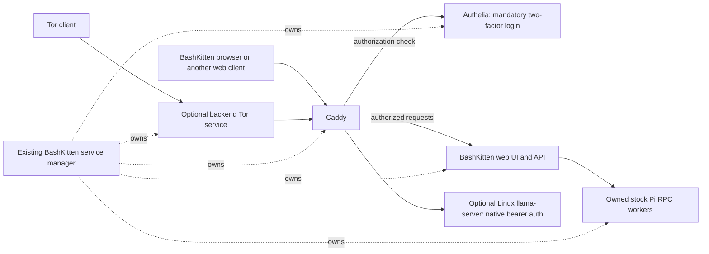

# BashKitten browser integration plan

Proposed architecture, 22 September 2026. This records the new requested
direction; it does not claim that the migration is implemented or tested.
For the migration, this plan supersedes the older Android/Termux suite plan
where they differ. Existing releases continue working until their replacements
pass the checks below. No donor repository, branch or release is deleted as part
of preparing this plan.

Latest clarification, 23 September: remove unrequested hard size/count/time
quotas in file transfers, ZIP operations, browser tools, search extraction and
model downloads. Keep ordinary backend/browser behavior, user cancellation and
actual format/protocol validation. Agent-tab protection must not restrict the
user’s own screenshots or ordinary content tabs. This supersedes earlier
references below to retained arbitrary operational limits.

Latest delivery clarification, 23 September: promote the browser implementation
onto `main` and delete the previous BashKitten releases. This supersedes the
earlier instruction to preserve the legacy release and separate product branch.
Use three build-only repositories, `bashkitten-build-arm64`,
`bashkitten-build-amd64` and `bashkitten-build-android`, for independent compiler
caches. Product source remains in this repository. Each builder checks out the
requested exact product commit and exposes its installable artifact in Actions;
the main workflow collects it immediately after upload. Builders never publish
releases. See `agent/packaging/README.md` for the workflow and secret arrangement.

## 1. Product boundary

Make BashKitten a Firefox-based browser on Android and Linux, using the existing
WildBuzzard browser code. Keep the current BashKitten web UI and shared server.
The browser displays the Agent interface and controls its local service; Node,
Pi, Caddy and Authelia run outside the browser, in Termux or native Linux.
Server-only operation remains supported; running it does not require opening
the browser, even when the Linux package contains both components.

Preserve the chat renderer, project/session sidebar, thinking and tool streaming,
compaction display, attachments, repository browsing, backend ZIP downloads,
provider login and native Pi session behavior. Pi remains stock: its own tools,
extensions, skills, models, credentials, sessions and RPC. This is not another
Pi adapter rewrite.
Use the browser's rounded control and panel styling throughout the Agent web UI.
The chat `/login` command opens Providers, like `/providers`. Native fork/clone
operations add and select their new chat in the existing sidebar.
Provider API-key prompts, OAuth links/device codes, pending status, cancellation
and errors appear inside the selected provider's own block. Show immediate local
feedback on clicking a method; never place the active flow offscreen at the top
of the provider list. Preserve input and expanded callback instructions during
status refreshes, including on mobile.
After provider login, logout or model refresh, update existing Pi workers at an
idle boundary through their native saved sessions; do not replay messages or
interrupt turns, queues or extension prompts. The model picker must show Pi's
actual selection, including an unset default, rather than silently displaying
the first available model without selecting it.
Sending to a saved stopped chat resumes its native Pi session; whole-app shutdown must not
mark every chat as deliberately stopped. Preserve an explicit Stop Pi until
the user sends, resumes or performs another session action.
Use Pi's accepted prompt and native pending count when retiring submitted queue
items. Skill/template expansion or extension input transformations can change
the text before the user message event; a consumed command must not remain queued.
Read streaming tool identity and arguments from Pi's partial content block and
final toolCall, retaining one visible tool card when a provider supplies its ID late.

Replace the Android WebView and Linux GTK/WebKit hosts with the browser. Remove
the Termux-suite distribution/store integration, API/X11 APK requirements,
X11 variant selection and graphics/display profiles. Keep package maintenance,
real APT/npm progress, backend controls and Pi stop/kill controls. No application
is automatically uninstalled, including previously installed suite components.

Keep Waterfox-derived privacy features, private tabs, Tor, ad blocking and normal
browser functions. Enhanced Tracking Protection keeps Gecko's signed tracking
list updates on both platforms; disabling telemetry and promotional feeds must
not leave its native controls without current blocking data.
Remove torrents, qBittorrent/libtorrent, their exclusive
Qt/Boost/build dependencies, custom search/torrent extensions and their special
permissions. Remove the external WildBuzzard extensions repository dependency.
Ordinary address-bar search, downloads and normal Firefox extension support are
not the custom search implementation being removed.
Audit every desktop menu, submenu, settings pane and built-in page. Remove
Firefox/Mozilla product, support and promotional links and dead controls for
removed services, including inherited Help actions. Preserve functioning
DevTools and ordinary extension controls; mandatory upstream attribution stays
in the offline license notices.
Bring Buzzard Search's Python search/read pipeline into this repository as a
built-in Pi skill, separate from the removed browser search extension. **DDGS
only for now**, as clarified by the user: no SearXNG engine, endpoint setup or
SearXNG source update in this migration slice.

## 2. One repository, source ownership and Firefox updates

Keep everything in **`openresearchtools/bashkitten`**, on its current product
branch. Firefox/WildBuzzard can live under `/browser`; preserve the complete
Mozilla source layout inside that directory. Move the existing shared app under
`/agent`, excluding the obsolete desktop/Android wrappers. Track the access-stack
sources under `/auth`. These are tracked source directories in one repository,
not Git submodules or a second product repository:

```text
openresearchtools/bashkitten/
  agent/
    src/web/                                # current UI, moved intact
    src/server/
      rpc/, files/, http/                    # existing shared implementation
      access/                               # access-stack config/lifecycle glue
      platform/{termux,linux}/
      updates/, control.mjs, instance.mjs
    pi/                                     # one native Pi integration package
      skills/web-search/SKILL.md             # on-demand DDGS/read instructions
      skills/browser-android/SKILL.md        # Termux/mobile browser controls
      skills/browser-linux/SKILL.md          # desktop browser controls
    search/                                 # adapted Buzzard Search Python CLI
      src/, third_party/                    # selected sources and provenance
      pyproject.toml, runtime lock files
    packaging/{termux,linux}/
    package.json, package-lock.json          # existing runtime/build metadata
  browser/                                  # full Gecko source root
    mach, moz.build, ...
    browser/                                # Mozilla desktop subtree
    mobile/android/                         # GeckoView/Fenix, same Gecko tree
    toolkit/, dom/, netwerk/, ...
    bashkitten/                             # renamed existing wildbuzzard/
      browser/, android/, components/
      branding/, scripts/, licenses/
      upstreams.toml, ports.toml, UPDATING-FIREFOX.md
  auth/
    authelia/                               # tracked upstream source
    caddy/                                  # tracked upstream source
    tor/                                    # tracked upstream source
    authelia-termux/                         # build recipe + required patches
    caddy-termux/                            # upstream Termux recipe/patch inputs
    tor-termux/                              # upstream Termux recipe/patch inputs
    upstreams.lock.json, build/              # exact revisions and build entry
  docs/, AGENTS.md
  .github/workflows/                        # one release/build matrix
```

Move the current UI/server/build files together instead of rewriting them. The
Pi browser integration lives under `agent/pi/`, sharing common code where useful
but providing distinct **Android/Termux and desktop Linux browser skills**.
The Android skill describes the mobile browser's actual tools, Binder transport
and native approval flow; the Linux skill describes its desktop tools and private
Unix socket. Each local target registers its matching browser skill/entry point
alongside the common web-search skill, with one concise, self-contained SKILL.md per platform covering every public command.
Pi capability discovery identifies the connected browser's complete guide;
`help` returns that same skill. Load it once rather than looking up a new manual
for each action. Cover every public command,
parameters, result shapes and platform differences without requiring an agent
to read implementation source. Verify controls by using them during the normal
Android UI flow and fix observed input/control failures on both platforms.
Keep both skill documents available in
the integration package for remote browser control: choose the guide/capabilities
for the authorized client browser, not the remote Pi server's OS. Do not present
desktop-only commands to the mobile agent or assume the browser capabilities are
identical. Install/update
these through Pi's supported package mechanism from the same release. They run
beside Pi, not inside the APK. Extract
the useful native Termux/setup/update integration from the current wrappers into
the browser, then remove the wrappers after their replacements work. Do not
keep two implementations. The existing `openresearchtools/apt` remains only the
distribution index, not another product-code repository.

Run Gecko builds from `browser/` using its `mach`; put build outputs outside
source. Adapt the small product scripts that assume the Gecko tree is the Git
root, and verify Mozilla's source/VCS metadata generation in this nested layout.
Keep Android and Linux on one Gecko source revision; do not create platform
branches or duplicate engine trees. All product release assets and corresponding
source come from this repository.

### Starting sources, checked on 22 September

| Source | Recorded starting point |
| --- | --- |
| BashKitten server/UI | `main`, `b20cf1cbf56a12a47a5f7a954bb473986539e230` |
| Desktop browser product | `WildBuzzard`, `refactor/browser-agent-independent`, `0bd2d7da099a365d2243b320e1e6b38e8ad76cf4` |
| Android browser | `wildbuzzard-android`, local `main`, `b970e591350863113c7ea1f110f12f296a1170bd` |
| Current browser Firefox pin | `FIREFOX_153_2_0esr_RELEASE`, `feec67e62a5148b41fd017ccbbc463e8a6f9e83d` |
| Newer official ESR tag already available | `FIREFOX_153_3_0esr_RELEASE`, `861fdeb0d32fe1bd101fea886687e680f612d735` |
| Torkitten reference | `main`, `783c0899029aad22cec9562142c067f6b55408a7` |
| Buzzard Search donor | `main`, `05721962dd11c7506286ecc9aa5b35f6fc4828d0` |

The recorded desktop product commit is already an ancestor of the Android
checkout. Start with that shared history and reconcile any subsequent donor
changes once; there is no need to combine two unrelated Gecko trees. The
desktop repository's default `main` is not the product branch listed above.
Recheck both product heads at implementation time. Preserve ongoing Android
work, including the currently modified README and UI audit; do not absorb
uncommitted donor files into the migration.

Keep `main` and the user-requested implementation branch. As subsequently
authorized by the user for a compact GitLab mirror, retain the complete Firefox
153.0 baseline and subsequent ESR/product commits, cutting the earlier Mozilla
and unrelated imported Arti/WebTorrent parent histories. Preserve every retained
commit's source tree, authorship, message and licenses; changed ancestry changes
its commit ID. Keep the original BashKitten history, `main` and existing product
release tags unchanged. Record exact official release/donor SHAs and their
compact source commits/trees in `upstreams.toml`. Use internal
`bashkitten/firefox/<official-release-tag>` tags; do not retain native official
tags or backup refs that make the omitted history reachable in a mirror.
Keep an independent recovery backup outside the product repository before the
cut. No permanent Mozilla tracking branch is needed. The current Waterfox donor is
`8ae6e039a06bcff8173cb4a4c0262beb21f81286`; keep applicable `ports.toml` records.

Keep the complete browser source at prefix `browser/` and its compact pristine
upstream base for three-way updates. Reuse `firefox_release.py` for version checks
and pins: shallow-fetch an exact new 153.x ESR tag only in an isolated temporary
repository, verify its original upstream SHA/tree, and transfer only its source
trees/blobs into the product repository. Create a compact upstream source commit
parented to the previous compact source base, then perform a real subtree-aware
three-way merge at `browser/`. Record the original SHA and compact source pin,
resolve actual conflicts and build both platforms. This preserves product edits
without fetching the discarded history again. Verify the merge cannot
write Mozilla files into `/agent`, `/auth` or the repository root. First reconcile
the donors, then update the unified tree to
[153.3.0esr](https://github.com/mozilla-firefox/firefox/releases/tag/FIREFOX_153_3_0esr_RELEASE)
or the newer verified 153.x release. This update is required for the first
migrated Android/Linux release, not a follow-up left on the old 153.2 base.
Recheck the latest official 153.x ESR release before that build. Do not
automatically change ESR major or rebase every product commit for each update. CI can propose the
update and build it; failed merges/builds cannot publish a release.

### Firefox-aligned product versions

Keep WildBuzzard's existing versioning rule and `firefox_release.py` checks:
BashKitten's major/minor matches the pinned Firefox ESR major/minor. For
Firefox **153.3.0esr**, the first product version is **153.3**, followed by
**153.3.1**, **153.3.2**, etc. for BashKitten maintenance releases on that same
Firefox line. Moving to Firefox 153.4.x starts BashKitten 153.4. Reuse the
donor's `next_product_version` logic rather than continue independent 0.x
browser numbering or invent another release scheme.

The full engine version remains exact: an About/build record shows, for example,
**BashKitten 153.3.1 · Firefox 153.3.0esr**, together with the pinned upstream
commit. A BashKitten maintenance suffix does not claim a Firefox security update.
An upstream ESR point update must actually be merged, pinned and built; merely
bumping the product number cannot satisfy it.

Use `browser/bashkitten/config/version.txt` as the product version source for
release tags, browser About, APK `versionName`, all three `.deb` payloads and
their update metadata. Retain a separately monotonically increasing Android
`versionCode` and normal Debian packaging revisions when rebuilding the same
product release. Keep dependency versions (Pi, DDGS, Tor, etc.) independent.
CI checks the exact ESR tag/commit, Gecko version files and product release line,
then verifies the versions inside the assembled APK/debs against the release
metadata. All platforms use the same engine pin; fail publication on a mismatch.

The compact history changes Git storage, not the full source checkout. Verify
the clean mirror's reachable refs, retained tree equality and packed size; old
official tags would undo the saving. Use shallow/partial clones for ordinary
builds and the retained compact ancestry for upstream merges. Keep recovery
objects outside the product repository and do not ship them in source archives.

### Reuse the working desktop build workflow

Adapt WildBuzzard's existing
[`wildbuzzard-hosted-artifact.yml`](https://github.com/openresearchtools/WildBuzzard/blob/0bd2d7da099a365d2243b320e1e6b38e8ad76cf4/.github/workflows/wildbuzzard-hosted-artifact.yml),
`wildbuzzard/ci/build-browser-artifact.sh`,
`wildbuzzard/scripts/build-linux-external.sh` and `package-deb.sh`; do not replace
them with a new single-job Firefox rebuild. The successful amd64
[run 33465518703](https://github.com/openresearchtools/WildBuzzard/actions/runs/33465518703)
built commit `2b1e1617374916d85d6fef9b1cbf987c64dd50f9`, reused component caches,
built the browser using the compiler cache and assembled the Debian artifact.
That run predates the donor's current Tor changes: reuse its build approach,
not its obsolete Arti/torrent payload or a claim that the current head was tested.

Keep independently reusable browser archives, native component artifacts and
source/license bundles, followed by final Debian assembly. An Agent/search/auth
or packaging-only change must not recompile unchanged Gecko. Remove the torrent
job and its assembly requirement. Add the Agent/search/auth payloads to final
assembly using the existing manifest/checksum pattern, with matching source.

Preserve Mozilla's pinned bootstrap toolchains, GHA-backed `sccache`, normalized
source/object paths, external build directories and the optional `gkrust`
warm-up job. Retain the proven amd64 runner resource settings (Ubuntu 24.04,
two build jobs and 8 GiB swap) initially. The warm-up performs configure,
pre-export/export and `toolkit/library/rust/force-cargo-library-build` before
the full build; it does not replace compiling changed native Gecko code with
Mozilla's artifact-only build mode.

Adapt both outer repository and inner `/browser` paths in the clone/build
scripts. Cache keys cover the component's actual source, patches, toolchain,
target architecture/ABI, configuration and relevant build scripts. Reassemble
when packaging changes; regenerate provenance rather than attributing an older
cached binary to a new source commit. Reuse only matching trusted artifacts;
cache misses must still build successfully. GitHub caches are
[repository-scoped](https://docs.github.com/en/actions/reference/workflows-and-actions/dependency-caching),
so the new workflow must establish its own caches rather than
assume WildBuzzard's cache entries automatically transfer.

Keep this same pipeline for Linux arm64 with native runner/build validation;
replace hardcoded amd64 archive names/metadata and verify its toolchain rather
than merely relabel the package. Demonstrate a cache-miss build, a cached repeat,
an Agent-only reassembly and invalidation after a Gecko/toolchain change. Keep
build logs and external verification evidence out of the shipped applications.

### Tracked authentication and Tor sources

Import complete Authelia, Caddy and Tor source at recorded upstream commits,
following Torkitten's source/provenance approach. Track each project's actual
main/default branch and import newer commits through source-update changes;
record the branch, exact commit, version and source provenance in the lock.
Build from checked-in source, never a moving network `main` during release.
Preserve notices, dependency locks and any required nested source. Updates build
and pass the relevant checks before publication; a failed update keeps the
previous working release.

`*-termux/` holds only reproducible build recipes and the minimal patch series,
not another copy of each project's source. Record the exact Termux-packages
revision and package patches used for Caddy/Tor. Keep any new Authelia Android/
Bionic adaptation here, with upstream source untouched until patches apply in
the build staging tree. A patch that no longer applies stops the build; do not
silently drop it or change authentication behavior to make compilation pass.

Build Linux arm64/amd64 and native Termux aarch64 from this one source inventory.
Ship the owned executables and required libraries with the server's package in
private BashKitten paths, so they cannot replace unrelated system `caddy`, `tor`
or `authelia` installations. Include their full dependency licenses and matching
source/build material. The browser's Tor client and backend Tor publisher remain
separate runtime instances; reuse `/auth/tor` source for compatible build targets
while retaining the necessary Android/JNI/browser integration and its notices.

Rename product names, package namespaces, executable/control names, branding,
URLs and preferences deliberately. Android keeps **`com.bashkitten`**, the
existing Droid signing key and a monotonically increasing version code so this
replaces the current BashKitten APK. Historical copyrights, upstream links and
license attribution retain their original names. Do not replace or rename an
installed independent WildBuzzard application.

Use the supplied black-and-white kitten wearing glasses with the gold terminal
as the product logo, as selected on 23 September. Keep
the original transparent PNG in the repository, generate square Linux/web icons,
and pad the Android foreground transparently to fit adaptive icon masks.

## 3. One window and a protected Agent view

One product profile and one browser window. Remove profile creation/switching
and new-window/private-window commands. Reject alternate-profile/new-instance
launch flags and disable profile creation through internal profile pages too.
OS URL launches, `window.open`, OAuth
popups and links requesting another window open ordinary tabs in the existing
window. File pickers and permission dialogs remain normal platform dialogs.
Private browsing uses private tabs, including on Android; completing Android's
single-window tab behavior is explicit work, not an assumption about Fenix.

Implement Agent as a browser-owned content view outside the ordinary tab
registry, presented as the permanent Agent tab. A pinned ordinary tab is not
sufficient. The browser creates exactly one, always selects it on startup and
restores it after a content-process crash. User tab-close/close-all/duplicate,
session restore and agent tab commands cannot remove, duplicate or replace it.
The user can still quit the application normally.

On phones, place **Agent** to the left of the address bar while browsing. In
Agent, replace the URL toolbar with a compact Agent/Local-or-Remote/power/menu bar.
Use one small power control showing On, Starting, Stopping or Off. Its On action
is **Turn off**; its Off action is **Turn on**. Do not add a separate wake-lock
toolbar or crowd the mobile bar with service switches.
On every screen size, startup and selecting Agent show it across the full content
area, with its compact controls replacing the ordinary address bar. Desktop
keeps a permanent, unclosable Agent tab visible in the tab strip. This native
Agent tab affordance is outside the ordinary tab registry; hiding an Agent pane
never removes it. Keep ordinary new-tab controls available.

On desktop, tablets and unfolded phones, opening or selecting an ordinary website
tab defaults to a split view with Agent beside that website. One control hides
the Agent pane for ordinary browsing without destroying its document; selecting
Agent always returns to the full Agent view. Android keeps its always-available
Agent access button from every ordinary tab, including on phones, which switch
between full Agent and full website views. Do not replace the permanent desktop
Agent tab with only an address-bar button. There is never a second application
window. Preserve chat drafts and scroll position when toggling, rotating or
folding. Profile creation and switching must be unavailable through menus,
internal pages and launch flags; internal Gecko data storage does not provide a
user-facing multiple-profile feature.

Enforce the protected-view boundary in native tab lookup and tool dispatch,
not just button visibility. Agent automation and normal extension tab APIs
cannot enumerate, screenshot, inspect, execute script in, navigate or close
Agent, setup, authentication or remote-credential views. Block whole-window
screenshots through the agent interface when they could include those views.
Browser-owned authentication content remains an unprivileged web document;
never give a remote server's HTML browser-chrome privileges.

Keep a single browser tool surface using explicit ordinary-tab IDs. Remove
profile/window selection, browser-session ownership machinery, torrent tools
and quit/restart commands. Keep useful tab navigation, DOM, input, screenshots,
network/debugging and file actions. Closing the last ordinary tab leaves Agent.
Concurrent Pi sessions use explicit tab IDs rather than a shared selected-tab
variable. Pi's own session identities and history are unaffected.
Android download results include their originating ordinary tab ID. Persist that
association across browser restarts so a restored open tab retains its completed
downloads; unknown historical associations remain unavailable to automation.

Reuse Android Binder and the desktop private Unix socket. **Any installed
`com.termux` can attempt browser control**, including official GitHub, F-Droid
and independently signed builds. Do not gate the exported discovery/Binder
entry point behind our signature or a vendor certificate allowlist. A matching
publisher signature may keep its existing optional trust shortcut; it is not a
compatibility requirement. Other Android apps use the same approval mechanism.

On an ordinary first command, look up the real caller using Binder's UID and
PackageManager. An already approved/trusted caller runs immediately. Otherwise
return a browser-owned approval PendingIntent, open the native Android approval
screen naming that caller, and run the held command once after approval. The
current donor CLI only opens this flow for explicit `--authorize`; extend it
to normal calls rather than leaving an error telling the user to authorize
manually. Keep denial/cancellation distinct from transport errors, and do not
repeatedly prompt or replay an already executed action. Calls from other apps
can receive/send the same PendingIntent. If Android blocks a background activity
launch, expose the pending approval when BashKitten is foregrounded instead of
claiming a popup can always be forced.

This is a native BashKitten allow/deny screen, not a new signature-only Android
permission. Remember approval against the installed app/signing identity and
verify actual UID/identity on every call; package-name strings alone cannot
authorize a caller. A different replacement APK requires approval again. Grants
are revocable in Agent access. Pi and other programs in Termux share Termux's
Android identity, and any shared-UID peers share that authority; do not pretend
these are per-Pi Android permissions. Keep the user-facing prompt understandable.
Do not revive the legacy TCP command-key service or require manually copied
browser-control keys.

If a selected remote Pi is allowed to control this client browser, the browser
opens an authenticated outbound connection through
the selected server. The user grants that connection browser control in native
UI. Reuse the same tab dispatcher over that channel; do not expose a public
browser-control listener or another MCP server. Close/revoke it on logout or
remote switch, and revalidate authorization on reconnect.

This protects browser automation interfaces. Stock Pi retains its unrestricted
shell: on the same OS account it can still run OS commands such as killing a
process. Preventing that would require a separate OS sandbox and would conflict
with the requirement to leave native Pi unrestricted.

### One power control and Android wake locks

On a fresh app launch, default to **Turn on**. On Android, the browser's existing
foreground keep-alive service acquires one non-reference-counted partial CPU
wake lock and the Termux controller runs stock `termux-wake-lock` once the command
permission is ready. Then attach to the healthy service group or start it.
Show Starting/setup until the required work succeeds. A screen rotation, settings
return or repeated lifecycle callback must neither accumulate locks nor undo
an explicit Turn off during the same app run. A later fresh user launch defaults
to On again, as requested. The ordinary screen may still turn off: this is a
CPU wake lock, not a request to keep the display illuminated.

Use the current Android foreground-service integration and ordinary WAKE_LOCK
permission. Hold/release at the app/controller level, never per Pi session or
per tool call. Fifty agents still mean one browser lock and one Termux lock.
There is no lease, expiry scheme or new Termux patch. Termux's stock wake lock is
app-wide, so Turn off releases that Termux lock; it is not an isolated lock for
BashKitten inside Termux. This does not terminate other Termux jobs.
See [Android wake locks](https://developer.android.com/develop/background-work/background-tasks/awake/wakelock/set)
and the upstream [lock](https://github.com/termux/termux-tools/blob/master/scripts/termux-wake-lock.in)
and [unlock](https://github.com/termux/termux-tools/blob/master/scripts/termux-wake-unlock.in) commands.

**Turn off** is one idempotent controller action:

1. Record the Off intent so reconnect/restart logic cannot undo it; stop accepting
   new turns and disconnect Agent control/stream connections.
2. Abort active owned Pi turns through stock RPC, checkpoint existing queues,
   close all BashKitten-owned workers and stop the owned web backend, Caddy,
   Authelia, backend Tor and managed llama processes. Use graceful shutdown with
   a bounded force-kill fallback for those exact process identities/groups.
   Leave native Pi session files, projects and credentials intact. Do not kill
   independently launched terminal Pi, unrelated daemons, Termux or the browser.
3. Do not kill dpkg during a package transaction. Show Stopping until an active
   package operation reaches a safe stopping point, retaining its actual log.
4. Run `termux-wake-unlock`, release the browser's wake lock, and exit the owned
   runtime controller after reporting completion. The browser-owned protected
   view shows **Agent off · Turn on** without needing a login/server connection.
   If shutdown cannot be confirmed, show that state and Retry rather than a
   false Off. Turn on can launch the controller through Termux even when all
   backend processes are gone.

On Linux the same control stops/starts the owned service group and Pi workers,
without Android wake-lock commands, and leaves the browser open on Agent off.
The browser's ordinary Tor tabs are distinct from the backend Tor service and
are not shut down by this Agent control. The desktop llama relay used for Agent
is disconnected on Turn off. This client control does not silently shut down a
remote machine: in remote-only mode it disconnects the client and releases its
browser lock, without requiring Termux or attempting remote OS power management.
If Android previously started Local, Turn off also stops that retained local
group and releases its Termux lock after switching to Remote.

On Android, closing/hiding the browser UI is not Turn off. Its foreground service can keep
the browser lock while alive and Termux can keep its own lock. Android can still
kill either process; wake locks prevent CPU suspension, not process termination.
Reopening reconciles the actual services and reacquires the required locks.

On Linux, Quit, closing the browser window, or killing its main process stops
the local Agent group it started or attached to, including owned Pi workers.
Track the exact browser PID/start identity through the existing native guard;
normal Quit also requests graceful shutdown. Stop Pi promptly while allowing
an active package transaction to finish safely. Switching to Remote does not
discard ownership of a local group already adopted in this browser run. A fresh
remote-only browser owns no local service and never stops the remote server.
An explicitly launched server CLI stays independent until the native browser
adopts it. Do not kill unrelated terminal Pi or other services.

## 4. Android setup with ordinary Termux

Opening **Local** checks the recorded service, then uses the Termux command
bridge to attach/start it if needed. If that fails, Agent shows the packaged
onboarding page. It works before the backend exists. A selected remote does
not need a local Termux installation merely to display that remote's UI.

1. If `com.termux` is absent, offer **Download Termux** using the current
   official GitHub release's matching APK and the browser's normal download and
   Android installation flow. Do not substitute our old suite build.
2. Open Termux for its initial bootstrap. Show one copyable command that downloads
   and verifies our published Open Research Tools Termux keyring package, installs
   it and `x11-repo` through `pkg`, upgrades the existing Termux packages and runs
   `pkg install bashkitten`. The `.deb` declares all required Node, Python,
   Git/archive, search/native-library and desktop dependencies, including XFCE,
   LibreOffice and Xvfb. Keep no duplicate dependency installer inside the APK.
   The upgrade is required before dependency installation: a fresh APK bootstrap
   may contain an older C++ runtime than the rolling repository's native packages.
   The same command enables external apps, reloads settings and returns through
   the installed BashKitten launcher after successful installation. The final
   activity component must come from the actual new APK.
3. On return, BashKitten requests Android's `com.termux.permission.RUN_COMMAND`
   permission directly. Verify a real command result before marking connected.
   Denied/permanently denied permission gets an appropriate Retry/Settings link.
   A fresh setup shows the command before requesting or probing this bridge;
   the successful command's launcher callback triggers permission and validation.
   Merely returning from an empty Termux installation must not cause a bridge error.
4. On the successful return, probe the installed package and start the service
   automatically, then complete account/2FA setup. No separate Connect or
   Install packages action is needed.

After installing the package, the command enables the ordinary Termux bridge:

```sh
mkdir -p ~/.termux && printf '\nallow-external-apps=true\n' >> ~/.termux/termux.properties && termux-reload-settings
```

The installer should avoid accumulating duplicate settings on repeated setup.
Append the explicit Android return intent after this command. The shell does
not grant an Android permission; the foreground BashKitten activity requests
the normal system dialog. The return intent accepts no arbitrary command to run.
This follows Termux's [RUN_COMMAND interface](https://github.com/termux/termux-app/wiki/RUN_COMMAND-Intent).

Keep the normal setup screen to the Termux button, one visible copyable command
and the existing Turn on/off control. The Start action drives this sequence. Request the normal Android permission
when it is needed, then probe the real Termux connection. Missing packages show
the same copyable `pkg` command. After the one-time command is
pasted in Termux, return through BashKitten's exported launcher and continue
without another Connect button. Do not show already-satisfied permission steps
or send every user to Android app settings. Show a settings recovery action only
when Android has denied further permission prompts. Installation displays native
`pkg` progress in Termux; there is no JSON/base64 installer screen in the APK.
Returning or reopening the browser reconciles the actual installed package.

Latest verification clarification: run normal Android in Cuttlefish and use its
visible UI for installation and operation. Do not use ADB, root commands,
bootloader changes, developer-option workarounds or preconfigured setup state.
On 25 September the user explicitly authorized disabling Android's child-process
restrictions through its visible Developer options toggle. This is the sole
exception to the developer-settings restriction; ADB, root, debugging and other
developer workarounds remain excluded. Record that setting in verification
results rather than claiming unchanged-default Android process behavior.
Do not add or run BashKitten-owned scripted tests. Complete builds and manual
first-install flows, fixing discovered failures before stopping. Label emulator
results accurately; compilation alone does not satisfy this acceptance check.

Existing compatible Termux installations stay installed. Use their ordinary
command interface; no signing match or new Termux patch is required. Retain an
existing suite-specific connection only as upgrade compatibility while moving
to the standard path. Permission for Termux/Pi to control the browser is a
separate native browser grant from permission for BashKitten to command Termux.
Present both during setup when required; do not claim one grant covers both.

Keep Node, Pi, Python, git, gh, archive utilities, the existing X11 repository and
useful desktop packages such as LibreOffice. Add the native `xorg-server-xvfb`
package for headless display and `xdotool` where needed. No Termux:X11 APK,
Termux:API APK, proot, root or Android shared-storage permission is required.
Do not remove already installed desktop packages simply because their old
control panel disappears. The short managed Pi environment note explains
Termux/Bionic, `pkg`, skill locations and how to start an owned Xvfb display
with `-nolisten tcp`, use `DISPLAY`, and stop its own display afterwards.
Do not describe the Termux:X11 APK-dependent server as headless Xvfb.

Keep package controls in the app's setup/settings area with an expandable
installed-packages list, explicit **Check for updates / Update packages**,
APT/npm/Pi stages and the existing bounded, scrollable real output. Reuse the
manager's durable jobs and locks. No package-network checks on every chat open.
Replace suite APK cards with the relevant Termux setup/status and BashKitten
update controls; there is no remaining suite app store to maintain.

Browser upload/download/paste uses Gecko and the Android picker. Working-folder
choices remain writable Termux home paths. The file sidebar has a path bar and
can browse readable files throughout Termux's own app data directory,
`/data/data/com.termux`, including its equivalent canonical Android path. This
does not require shared storage or access to another app's private directory.
Keep this browsing scope separate from the working-folder picker.

The Termux sidebar has Files and Changes views. Files retains ordinary upload,
open/download and whole-repository ZIP download, and adds Select mode with
checkboxes, an all/none selection control, Copy to a chosen Termux directory,
and Delete with confirmation showing the selected items. Use one contextual
Download action: the current folder normally, or selected items while selecting.
Do not duplicate Folder ZIP/Download ZIP actions or stack redundant toolbars.
The compact path field submits on Enter, with Up and Refresh controls. Long copies,
deletions and ZIP creation run in on-demand child processes with bounded progress
and cancellation, rather than blocking the HTTP server or building archives in
the browser. Validate paths and symlinks on the backend, avoid overwriting existing
copy destinations, and clean up workers and temporary downloads. Closing the
sidebar does not cancel an operation; stopping Agent stops its owned workers.

Changes is a read-only Git view: keep a sidebar list of files changed since the
last commit, including staged, unstaged and untracked files. Each file shows
green added and red deleted line counts beneath its filename. Clicking a file
opens a wide central diff view with line numbers and red/green change blocks;
the desktop sidebar remains a file list. Do not replace that list with a narrow
raw Git patch. On mobile use a readable full-width diff with Back to files.
Closing the diff restores the existing chat without losing its draft or scroll.
Escape file content and omit raw Git metadata noise. Handle new repositories,
renames, deletions and binary files accurately. Run bounded asynchronous Git
commands, refresh only on visible/focus/manual or actual work changes, and do
not install filesystem watchers or poll hidden sidebars. If Git is not initialized,
show that state until a later refresh detects it. BashKitten does not initialize,
stage, commit or otherwise manage Git; the user or stock Pi does that. The local
Linux desktop shell shows Changes instead of a full file manager, with native
folder opening still available. Remote connections retain file browsing because
their paths are on the remote server.

Completion notifications move from
Termux:API to the browser's Android notification integration, with user-controlled
notification permission and deduplicated turn IDs. Receive them over the live
authenticated service connection, using a user-enabled foreground service for
background delivery. Force-stopping the browser prevents delivery until it is
opened again; do not claim the OS cannot kill it. No Pi modification is needed.

## 5. One managed HTTPS/authentication service



Reuse Torkitten's configuration patterns, source attribution and private socket
boundaries, not its OCI container deployment. Build the vendored `/auth` sources
and extend the existing controller under `agent/src/server/` to own the complete
service group. The browser never hosts the Node backend itself.

**One lifecycle, not a claim of one PID:** Caddy and Authelia are Go programs,
Tor is native C, and the existing server is Node. Copying their source into this
repository or packaging their executables together does not link them into the
Node process. Embedding all four literally would require substantial integration
patches/runtime changes, contrary to retaining their normal upstream behavior.
The proposed implementation is one foreground launcher/owned process group with
one On/Off state, child-exit handling and group shutdown. Do not describe that
as an in-process library implementation. If one PID becomes a hard requirement,
resolve that architecture separately rather than claiming this satisfies it.

Use Authelia's file user store and SQLite storage, with its supported Redis
session provider backed by an owned, bundled Valkey process. The user's
23 September requirement that Remember me survive full app/service restarts
supersedes the earlier memory-only/no-Redis choice. Use a private Unix socket
with no TCP listener and durable session persistence under the existing private
access directory. Preserve Authelia's session encryption, expiry, logout and
mandatory second factor. Start and stop this store with the whole service group;
do not keep authentication processes alive after Turn off. No LDAP, second
BashKitten account database or custom authentication layer.
Reuse Torkitten's local account/TOTP enrollment approach, calling Authelia's own
commands/APIs and requiring a valid second factor before setup completes.
Enrollment is available only through the local private setup controller; remote
visitors cannot claim an uninitialized server. Include local recovery of an
owner's factor without adding a remote authentication bypass.

Caddy is the only web entry point. Backend and authentication/admin endpoints
use private Unix sockets where supported, not a second public HTTP port.
Protect chat, RPC, events, files, uploads, settings and WebSocket upgrades using
Authelia `two_factor` forward authentication. Strip incoming identity/forwarded
headers and derive identity only from the trusted proxy. Keep Origin/CSRF and
filesystem confinement checks. Only required login assets/endpoints, branding
assets and scoped certificate discovery are outside login. About and license
notices are packaged in native browser settings, with no standalone web pages.
Long-lived authenticated
channels must close on logout/revocation and reauthenticate after expiration;
authenticating their initial upgrade alone is not indefinite authorization.
See [Authelia's Caddy integration](https://www.authelia.com/integration/proxies/caddy/).

**Local address:** use `https://127.0.0.1:<port>` directly, with the actual
dynamic, unprivileged port obtained from the existing verified service discovery.
`<port>` is not a new fixed port or a permanent part of the server's identity.
There is no public domain, DNS lookup, domain registration, hosts-file edit or
dependency on `bashkitten.com`; that domain remains the user's website. The
earlier claim that the pinned Authelia version needs a registered hostname was incorrect:
Authelia v4.39.20 explicitly accepts IP cookie scopes, including `127.0.0.1`, in
its [validator](https://github.com/authelia/authelia/blob/v4.39.20/internal/configuration/validator/session.go#L124-L142)
and [upstream validation cases](https://github.com/authelia/authelia/blob/v4.39.20/internal/configuration/validator/session_test.go#L839-L868).
Configure its cookie scope as `127.0.0.1` and portal as
`https://127.0.0.1:<port>/login`. Keep a distinct cookie name and the protected
Agent cookie context for this instance: cookies themselves are not port-scoped.
Check the complete HTTPS login/TOTP/cookie flow on both target browsers in the
first implementation gate; configuration acceptance alone is not that check.
Other browsers can use the same loopback URL with their normal certificate
trust flow. No unauthenticated localhost endpoint is retained.

Use Caddy's internal CA and HTTPS certificates. The local bridge supplies the
public CA/identity to the browser over the existing trusted local channel.
Include the loopback IP in the certificate's subject alternative names. Trust
is bound to the enrolled instance's persistent CA/key identity. TLS certificates
identify the IP/hostname, not the TCP port. The controller supplies the current
endpoint separately: after a verified port change the browser connects to that
new port and verifies the same identity. It does not enroll a new CA merely
because the port changed, and another process occupying the old port cannot
replace the saved identity with its own key.
Remote enrollment supplies the corresponding identity. Trust only that enrolled
server/origin in its Agent/remote context; never globally trust arbitrary
self-signed certificates or disable certificate verification. Keep hostname,
expiry and key-change checks. Trust the persistent CA rather than a short-lived
leaf so automatic certificate renewal does not break the connection. Reuse and
tighten Android's existing enrolled-onion TLS handling, and implement the same
scope on desktop. No user certificate import is needed in BashKitten. Other
browsers retain their normal certificate trust rules.
[Caddy local HTTPS](https://caddyserver.com/docs/automatic-https#local-https).

The core group is ready only when Node, Caddy and Authelia are healthy, plus the
backend Tor process when remote publishing is enabled. A core child exit or
fatal health failure stops ingress and shuts down the remaining owned group,
including BashKitten's Pi workers, using the same shutdown path as Turn off.
Release the wake locks, show **Agent off** with the error, and let **Turn on**
start the complete group again. Do not leave three independent crash/restart
loops or report On for a partially functioning stack. A temporary Tor network
outage is connection status, not by itself a crashed process. The previously
requested llama process recovery remains an owned optional operation while
Agent is On; it cannot restart after Turn off.

Keep the lifecycle owner outside the HTTP child. Track owned process identities
and start times, include all BashKitten-owned Pi workers in group shutdown, and
use native parent-death/cleanup support where needed. If the existing Node
launcher cannot enforce cleanup when killed, use one small native process-group
guard; do not patch each upstream daemon or add a generic supervisor framework.
Prove this with SIGKILL of the owner as well as individual children before
claiming coupled failure handling. An already-dead JS controller cannot execute
cleanup. On recovery, reconcile the recorded group and either attach to a
complete healthy instance or clean up its owned incomplete remnants before
starting. Proxy authentication continues to fail closed throughout; credentials
never go to a direct backend fallback. Keep bounded, credential-redacted logs.

Keep the existing single-instance locks and dynamic-port discovery in
the current `src/server/instance.mjs` and `src/server/http/server.mjs`, relocated
under `agent/`. The current server falls back to an OS-assigned port on
`EADDRINUSE`, writes the actual URL to
`server.json`, and the Android host reads the controller's `web.url`. Preserve
that discovery contract when Caddy becomes the HTTPS entry point: publish
Caddy's actual bound URL, not the private backend address. Reuse an available
previous port or select a free one, retry bind races and publish only after
readiness. Regenerate Authelia's portal/redirect URLs for that actual port before
publishing readiness; its IP cookie scope and the server's CA stay unchanged.
Never attach to a port just because something responds there.
On connection failure/reopen, query the private controller again, obtain the
current URL, verify its enrolled TLS identity, then reconnect the protected
Agent view and streams. No port scanning, fixed-port assumption, public DNS or
automatic trust of whatever certificate a new listener presents. Verify TLS
before sending credentials or private instance tokens. Preserve drafts across
an origin/port change through existing state handling or the protected browser
host; never replay a consumed prompt as part of reconnecting.
On Android resume, request status through Termux. An explicit Turn off or a
failed group remains Off during that app run, with Turn on available; a fresh
user launch defaults to On as specified above. Android UI closure does not stop
the service; Linux browser closure stops its adopted local group as specified
above. Workers never outlive an explicit whole-group shutdown or fatal core-group
failure. This supersedes the
previous plan's independent Pi survival across an access-stack failure. Native
session files remain the recovery source: restarting opens the existing history
without replaying an interrupted prompt. Keep individual Pi stop/kill controls
in settings as well as the compact whole-Agent power button.

Browser cookies and remembered Authelia sessions survive browser and service
restarts, including a changed dynamic port. Verify this with a real two-factor
Remember me login, complete group shutdown/start and the same cookie, then
verify that explicit logout still revokes it. Bundle the session-store binary,
source and notices for Linux amd64/arm64 and native Termux aarch64.

**First technical gate:** build the vendored Caddy/Tor for Termux using the
recorded upstream Termux recipes/patches. Authelia had no recipe at the checked
upstream package path; its `auth/authelia-termux/` recipe must prove a native
Android/Bionic build, including frontend assets and dependencies. Prove SQLite,
password hashing, TOTP enrollment, Caddy forward-auth, whole-group lifecycle and
both wake locks on unrooted Termux before replacing the working login. Publish
the verified bundled server package through our existing APT. Do not relabel
a Linux/glibc ARM64 binary as Termux aarch64 or quietly introduce a container/
proot fallback. This portability and shutdown behavior are not yet tested.

## 6. Remote Agent connections and Tor

Every backend has **Settings → Remote access**: off/on, address, QR, save/import
connection file and copy/reveal controls. Keys are masked by default. Publish
through a backend-owned Tor onion service, separate from the browser's client
Tor process. Android browser closure leaves publishing running. Linux browser
closure stops its adopted group, including publishing; standalone CLI servers
remain independent until adopted. Explicit Turn off stops the published service
with the rest of Agent.

Use Torkitten's v3 client authorization and Caddy/Authelia route pattern. A remote
connection record contains its name, kind, onion endpoint, client authorization
key and scoped TLS trust identity. One compact versioned format supports QR,
file and manual entry; reuse the existing browser import controls rather than
three implementations. A compact CA public-key pin can be carried in the QR;
enrollment must verify the presented CA against it. Manual onion-address/key
entry can obtain and pin the CA through the authenticated exact v3 onion
connection, using the existing narrowly scoped enrolled-onion TLS handling.
It needs no extra certificate-import step, allows no clearnet fallback and
does not grant trust to other sites. Keep passwords and TOTP seeds out of
connection exports. Tor access does not bypass Authelia
login or its mandatory second factor.

Store secrets through Android Keystore or the existing desktop NSS secret store.
Never navigate to credential-bearing QR URLs or put them in browser history,
referrers or logs. Imported server authority is limited to the selected remote;
it cannot acquire local package-install/shell-control permissions. Server-side
device key revocation disconnects that enrollment. Use separate Agent and llama
Tor identities when their access needs independent revocation: Tor client auth
protects a whole onion service, not individual URL paths.

The Agent bar has **Local / named remote** selection and connection status.
Switching changes the protected view's server while keeping per-server login
state and reconnect information. It does not create a browser profile or window.
Client connection import and saved connections belong only to the browser's
selector and a non-modal browser-owned view with Back to Agent, never an overlay
over server settings or a web-to-browser import shortcut. The server web UI only
sends publishing/key/export requests to the backend. Put its device connection,
QR and file export controls immediately below the published server address.
Enabling or disabling publishing must retain the local loopback endpoint and
local login session; it must not select a Tor client connection or restart
Authelia merely to add/remove the already prepared onion cookie scope.
An ordinary onion link remains an ordinary private Tor tab. The enrolled Agent
context can persist its login independently; its cookies/keys never become the
ordinary onion tab's session. Enrollment/remote-management tools are not exposed
to the agent automation API.

### Hosted local websites

In the same **Settings → Remote access** panel, let the owner add, edit, disable
and remove named loopback HTTP services. A single valid DNS label such as
`randomwebui` and target `http://127.0.0.1:3030` publishes
`https://randomwebui.<agent-address>.onion` through the existing Tor/Caddy stack.
Reject invalid labels, non-loopback targets and embedded credentials. Keep all
these websites behind the same Authelia two-factor policy; the existing separate
llama.cpp bearer-auth route remains the sole API exception. Reuse Torkitten's
route pattern and attribution without adding a second control UI.

Show enabled, reachable services in a compact bookmark row above the connected
Agent chat. Check health on visible/focus/manual refresh with bounded cached
loopback requests, not continuous polling. Opening a bookmark creates an ordinary
controllable private Tor tab, with the usual Agent split on desktop/tablet. The
native browser verifies the registered service and inherits only that enrolled
server's CA and Tor client authorization for its valid service hostnames. No
global certificate bypass. Keep account/login pages protected from automation;
hosted sites must not receive or overwrite Authelia credentials. Local and onion
connections use the same account and factor, with stock Authelia cookie scopes;
do not copy a loopback session into an onion cookie provider or bypass login.
When Local needs the separate onion sign-in, keep its existing loopback document
and draft intact. Show a temporary protected sign-in with a return control,
restore Local after authentication or cancellation, and open the hosted website
in an ordinary private tab. Do not leave the Local selection using Tor.

## 7. Desktop llama.cpp and the browser's loopback relay

There are two distinct functions: a Linux backend can run/publish llama.cpp;
the desktop browser can expose a remote llama endpoint to local clients.
Neither function hosts the Agent server inside the browser. Android keeps its
remote Agent client without the desktop llama runtime/relay feature.

For a published llama endpoint, use the same Caddy instance with a separate
exact host/onion route to the loopback llama-server. That route does **not** use
Authelia. Keep llama.cpp's own bearer-token validation, preferably configured
with `--api-key-file`. Proxy the original method, path, query and body; do not
strip `/v1` or convert its API. Do not attach Agent cookies or identity headers.
The token belongs to llama.cpp, not a second Caddy token database.

In desktop **Remotes → Add → llama.cpp**, reuse QR/file/manual import and show
health plus the assigned local port. The browser's narrow loopback listener
forwards to exactly that enrolled HTTPS onion through its own Tor connection
and inserts the stored `Authorization: Bearer …` header. Stream responses and
uploads with backpressure, preserve status/content types and cancellation, and
support the endpoint's streaming transports without buffering complete turns.
Never fall back to clearnet or follow a redirect that would leak the credential
to another origin. Replace caller-supplied authorization, strip browser cookies
and validate the listener's Host/Origin so a web page cannot use it as an open
authenticated proxy. It remains a service for trusted local OS clients.

Bind only loopback, remember/reserve each endpoint's port, and report a bind
conflict rather than connect to an unknown listener. If a new port is selected,
show it and update only BashKitten-managed provider configuration. Any normal
OpenAI-compatible client can use `http://127.0.0.1:<port>/v1`; Pi uses its standard
custom-provider configuration. A remote Pi runs on the remote host: its
`localhost` is not this desktop, so configure its model endpoint on that host.
Do not imply a browser-local port is automatically reachable by a remote agent.
The relay is available while this browser is running; closing it closes that
port. This is the deliberately requested browser relay, not a second chat server.

For a **managed local Linux runtime**, reuse the current packages from
[llama-deb](https://github.com/openresearchtools/llama-deb): `llama-cpp`
(Vulkan/CPU) or `llama-cpp-cuda` for both Debian arm64 and amd64. They conflict
because they supply the same commands. Use APT for an actual change, show its
output and never reinstall an already satisfied selection. Do not bundle both
runtimes, NVIDIA drivers, Unsloth Studio or PyTorch into the browser.

Auto selection probes the available driver/devices and verifies the selected
llama binary can load its backend. Prefer CUDA only when the packaged CUDA 13
runtime, driver and supported device actually work; otherwise use supported
Vulkan or explicit CPU mode. Retain an override. Unsloth's
[setup/detection code](https://github.com/unslothai/unsloth/blob/main/studio/setup.sh)
is a reference, not a new dependency. The existing CUDA packages require system
CUDA/driver libraries; merely seeing an NVIDIA vendor ID is insufficient.

The existing backend manager starts an owned llama-server with the chosen model
and options when that managed provider is selected. Show Starting/Loading/Ready/
Failed and wait for model readiness before offering it as ready. Restart a
crashed owned process with bounded backoff; deliberate Stop remains respected.
An existing external HTTP provider is probed, not killed or restarted. Failed
in-flight inference is reported to stock Pi without silently replaying a prompt.
`/health` alone is not proof of token validity: upstream deliberately exempts it
from API-key checks. Also verify an authenticated model request and the selected
model. [llama.cpp server interface](https://github.com/ggml-org/llama.cpp/tree/master/tools/server).

### Model downloads and one models folder

Add **Settings → Download models** to the shared web UI, usable locally and
remotely on Linux and Termux. Adapt the useful SimpleHF/BashKitten Rust downloader
behavior, retaining donor license texts and provenance. Search Hugging Face,
browse repository files and sizes, choose downloads, and display real progress
with Pause, Resume and Cancel. Pin each download to its selected immutable
revision, stream to temporary files, validate resumed ranges, and retain progress
across server restarts. Hiding the Agent view does not stop a download; whole-Agent
shutdown stops owned transfers safely. Do not add another resident daemon.

Save an optional masked Hugging Face token in private server credential storage,
never status responses, URLs, logs or browser localStorage. Preserve native
password-store integration where the client owns a credential, without making
headless or remote downloads depend on that client staying open.

Local Linux uses the browser's native system folder picker for working and models
directories, accepting the selected directory directly and preserving cancellation.
Android/Termux and remote sessions use the backend folder picker, which lists
the actual subdirectories at every depth. One picker selects the shared models directory. Downloads
go there, and managed desktop llama.cpp receives that same directory through
its native `--models-dir`. Store each GGUF model/quantization family in a direct
child directory that native llama.cpp discovers, preserving filenames and split
shards; do not invent a recursive model registry or shadow symlink tree. Retain
original repository paths in download metadata. Refresh the native model list
after downloads and load the selected native model ID before declaring Ready.
Preserve existing external HTTP providers and existing single-model setups.

## 8. Built-in DDGS search and Markdown skill

Import and adapt the useful code from
[`buzzard-search`](https://github.com/openresearchtools/buzzard-search/tree/05721962dd11c7506286ecc9aa5b35f6fc4828d0)
under `agent/search/`. Keep one Python implementation for Linux amd64/arm64 and
native Termux aarch64. Replace the donor's amd64-only Ubuntu/PyInstaller delivery
with our existing packages and platform Python; no standalone search install,
Python inside the APK, browser search extension, MCP service or resident search
daemon. The helper runs when called and exits afterwards.

**Both Linux `.deb` builds include our own packaged DDGS runtime**, its locked
Python dependencies and the required native Python extensions built for Linux
amd64 or arm64. The Termux `.deb` includes the equivalent Android/Bionic build.
The common search skill calls the matching packaged helper on all three targets;
it must not depend on a separately installed `buzzard-search`, a user's DDGS
installation or a first-use `pip install`. The platform Python interpreter and
declared ordinary OS libraries remain package dependencies. Package native
bindings/product dependencies privately and record their ABI requirements.

**Scope is DDGS only for now.** The donor's current `.deb` contains a SearXNG
JSON client, not a bundled/preconfigured SearXNG engine. The user explicitly
chose DDGS after this distinction was explained. Do not add either a local
SearXNG server or an external endpoint requirement, and do not import its
server/dependencies. Leave SearXNG work deferred rather than describing it as
part of the delivered search. The donor repository remains untouched.

Keep DDGS underneath one simple call interface and retain the shared read
pipeline: fetch selected HTML/text, PDFs, GitHub repository/tree/blob content
and available YouTube transcripts into
Markdown. These readers are useful independently of which engine found the
URL; importing them does not require adding separate GitHub/YouTube search
providers now. Preserve source URLs, titles, bounded inline output and the full
saved `.md` artifact path. Failed/blocked downloads or missing transcripts must
report their real error, not produce fabricated content or an empty success.
JavaScript-only pages can use the existing separately authorized browser skill.

### Stock Pi skill and portable files

Declare `agent/pi/skills/web-search/` in the integration package's `pi.skills`.
Its short `SKILL.md` tells stock Pi when/how to run the packaged
`bashkitten-search` helper and read/save the resulting Markdown. Let Pi discover
the description and read the full skill on demand, including native
`/skill:web-search`; no custom skill loader, prompt injection on every turn,
replacement tools or new Pi RPC commands. Normal Pi `bash`/`read` calls already
stream through the current transcript UI. Register the package for the selected
Pi runtime through its supported mechanism, preserving user skills/extensions.
It must also work from ordinary terminal Pi without the BashKitten UI.
Follow the pinned [native Pi skills interface](https://github.com/badlogic/pi-mono/blob/13cbf77df2396303013a41646bcfa77b4271ae56/packages/coding-agent/docs/skills.md).

### One search/read call

Use the same `bashkitten-search` command on every platform, accepting one JSON
object on stdin. Model-facing examples need only one of these inputs:

```json
{"query":"Termux Python package documentation"}
```

```json
{"url":"https://termux.dev/en/"}
```

Require exactly one non-empty `query` or `url`. A query searches DDGS and returns
titles, URLs and snippets; a URL reads that resource through the shared Markdown
pipeline. No `provider`, `searxngUrl`, `--extra`, provider routing, repeated
operation name or different search/fetch command for the model to choose.
Remove unused provider-specific schemas, switches, imports and dependencies
from the adapted helper. DDGS handles its own search engines. Keep sensible
defaults (five results), without arbitrary size/count/time caps; optional supported
filters/output-directory settings need not clutter the basic skill examples.

Adapt the short model guidance from Unsloth's
[`WEB_SEARCH_TOOL` and `_web_search`](https://github.com/unslothai/unsloth/blob/bfcaea46574d63ec470ce9c7d7221471a38ea7e4/studio/backend/core/inference/tools.py#L8886):
search for candidate sources, treat snippets as previews, then read relevant
URLs before relying on their contents. Express this in the normal Pi skill,
without importing Unsloth's agent/tool runner or adding a custom Pi search tool.
Preserve the existing Unsloth attribution for adapted instructions/code.

Reuse the donor's working Python search/read functions but replace its multiple
CLI/output contracts with one compact JSON response envelope. Both modes return
`ok` and bounded `content`; search adds `results`, while page reads include the
source URL, `fullMarkdownPath`, `contentLength` and `truncated`. Keep one error
shape, a nonzero exit on failure, and diagnostic logs on stderr. The helper is
a local process, not a new HTTP search API. Its package-relative launcher removes
the donor's fixed `/usr/bin/buzzard-search` path.

**Save the complete extracted Markdown before truncating the inline preview.**
Every successful page read returns its actual saved path, even for a short page.
Keep the 16,000-character inline budget and let Pi read the saved file for the
rest, instead of downloading again or mistaking the preview for the full page.
Never write only that shortened preview to the purported full Markdown file.
Report actual download/extraction errors without imposing download/page quotas.
Preserve user-specified deadlines, cancellation and redirect/DNS/content checks; these apply to
this helper, not to Pi's unrestricted native tools.

Replace hardcoded `/tmp` and `/usr` assumptions with the platform paths. Default
full Markdown to a private writable BashKitten data directory, available across
UI/server restarts; support an explicitly selected project output directory.
Use unique filenames and return the actual path. Keep private directory/file
permissions and safe creation, handle spaces/non-ASCII paths and concurrent
agents without overwrites, and never require Android shared storage. Stock Pi
can read/copy the saved document; the existing authenticated files UI can offer
it for browser download. A remote Pi's saved path belongs to that remote server.

### Updated sources and native dependencies

Update the donor's DDGS 9.14.4 pin to the verified
[9.16.0 release](https://github.com/deedy5/ddgs/releases/tag/v9.16.0), commit
`70a5635510fb8d5b15d5ba6ceced6a67e212149b`, or a newer checked release at
implementation time. Record exact source revisions, archive hashes, dependency
locks and applicable patches. The checked 9.16.0 source archive has SHA-256
`161ca8e78ea08d40cd3f83fb12279b49322ffb342d981368bfa39bed9847d874`.
Track DDGS updates with the existing source-update/release flow; never resolve
floating dependencies during a user's first search. Include installed search
versions and updates in the existing package-update view, with real output;
APT updates the managed Python payload, without `pip` overwriting system files.

| Component | Native Termux implementation |
| --- | --- |
| DDGS / Click and other pure Python dependencies | Locked Python sources installed with the helper, using Termux Python |
| `primp` | Build its Rust/PyO3 extension and native dependencies for Android/Bionic; neither the donor's 1.3.1 nor checked latest 2.0.1 supplies an Android wheel. Verify the chosen exact version against DDGS; no Termux recipe was found in the checked package tree |
| `lxml` | Reuse Termux `python-lxml`, `libxml2` and `libxslt` packages/recipes |
| PDF to Markdown | Reuse Termux `python-pymupdf`, `python-mupdf`, MuPDF and their patches; package a compatible locked PyMuPDF4LLM and its required dependencies |
| HTML/text, repository and transcript readers | Retain the donor's selected Unsloth conversion/network code, Git integration and transcript dependencies; adapt only required platform paths/interfaces |

The checked Termux-packages revision is
`748983f1e4376b17babf23143baebd244e589b52`. It supplies
[`python-lxml` 6.1.3](https://github.com/termux/termux-packages/blob/748983f1e4376b17babf23143baebd244e589b52/packages/python-lxml/build.sh),
[`python-pymupdf` 1.28.0 revision 1](https://github.com/termux/termux-packages/blob/748983f1e4376b17babf23143baebd244e589b52/packages/python-pymupdf/build.sh)
and MuPDF 1.28.2 revision 1; the PyMuPDF recipe includes its MuPDF API
compatibility patch. Prefer those existing native packages when compatible.
For missing/changed components, keep the necessary source recipes and minimal
patches under `agent/packaging/termux/`, recording their provenance and building
from staged source. Deliver resulting dependencies through the existing APT or
private package payload as appropriate, not compilation on the user's phone.
Do not substitute glibc/manylinux wheels for Termux binaries or require proot.

Use the platform Python with isolated product dependencies, exposing declared
system bindings where needed without modifying unrelated Python installs.
Record Python ABI and native library requirements; verify updates cannot leave
an importable Python module with incompatible shared libraries. PyMuPDF4LLM's
newer releases add layout dependencies, so resolve and verify the actual
dependency set instead of blindly upgrading every converter. Preserve real PDF
text/tables/Markdown behavior; do not silently drop PDF support or relabel plain
text as equivalent layout extraction. Native builds still need the 4/16 KB
Android checks. This portability is planned, not yet proven.

Preserve Buzzard Search/selected Unsloth Studio **AGPL-3.0-only** notices and the
Unsloth source pin `bfcaea46574d63ec470ce9c7d7221471a38ea7e4`, manifests and
per-file headers. DDGS itself is MIT; the Unsloth-derived integration/conversion
code is separate and must not be relabeled MIT. Preserve retained MIT
`pi-web-access` repository-reader attribution, transcript notices, MuPDF/
PyMuPDF licenses and native/font/transitive notices for what is actually shipped.
Regenerate the inventory for the new targets: the donor's amd64 PyInstaller
license bundle is evidence, not an accurate inventory of our new packages.
Include search licenses in offline browser About, and publish
matching source/build material. Do not import the donor's application test suite,
fixtures or verification utilities into product source or release payloads;
keep our checks in the external verification workspace.

## 9. Delivery, retained behavior and licenses

For now, all published releases are testing releases. Every release description
must include the README's testing-warning SVG and explicit text that the release
is not ready for production. Keep this notice in generated release notes and
the publication workflow, and apply it to already published releases. A testing
label does not claim retail-device acceptance or replace the required checks.

Build these **four primary binary artifacts from this one repository**:

| Artifact | Complete product payload |
| --- | --- |
| `bashkitten_VERSION_amd64.deb` | Linux x86-64 browser, Agent web UI/server, native Pi and production npm dependencies, browser-control Pi extension/skill, DDGS Python search/read helper and Pi skill, Caddy/Authelia/Tor and lifecycle tools |
| `bashkitten_VERSION_arm64.deb` | The same complete Linux product built for ARM64 |
| `bashkitten_VERSION_aarch64.deb` | Native Termux/Bionic Agent web UI/server, Pi and production npm dependencies, browser-control Pi extension/skill, native DDGS search/read helper and Pi skill, native Caddy/Authelia/Tor, lifecycle/bootstrap/package tools; browser control and search execute in Termux beside Pi |
| `bashkitten_VERSION_arm64-v8a.apk` | Android browser, protected Agent/onboarding UI, native Binder/Termux integration, power/wake controls, browser Tor client and offline notices; the backend and Pi extension run from the Termux package |

No separate WildBuzzard install, separately maintained browser repository or
manual extension download is required. One release publishes all four verified
artifacts plus checksums, licenses and complete corresponding source/build
material. The existing APT repository indexes the three `.deb` targets; Android
installs/updates the APK through its normal package installer. Linux uses one
complete `.deb` per architecture rather than separate new server/wrapper packages.
Provide a proper APT upgrade/replacement from the old `bashkitten` server and
`bashkitten-desktop` wrapper, preserving user data and resolving owned-file
overlap through package metadata, not deleting arbitrary files.

Bundle the product's own access-stack executables, Pi/npm/extension payloads and
the search Python code/dependencies described above.
Declare ordinary platform runtime libraries, Node and the existing Python/git/gh
environment dependencies through APT/Termux bootstrap; do not vendor a second
OS package manager, the Termux APK, GPU drivers or model weights into these files.
Register the bundled integration using Pi's supported package mechanism for the
selected runtime without overwriting an existing independent Pi installation.
Linux packages include the desktop browser skill; the Termux package includes
the Android browser skill. Both include the search skill and their own compiled/
packaged search runtime, with platform-specific capabilities documented accurately.
The same updater updates the bundled extension, skills and managed search
payload with the product.

Verify both 4 KB and 16 KB Android execution for the APK's native libraries and
executable Termux packages. Keep the APK's current signing identity and the
separate APT signing identity. A Linux browser can connect remotely without
starting its local backend; the packaged server CLI can likewise run while the
browser is closed. A Linux browser that starts or attaches to Local adopts that
group's lifetime; closing or killing that browser stops the adopted group.

Reuse current APK update checking/signing and APT/npm jobs, replacing suite
catalog ownership with browser/server release metadata. Preserve selected
external Pi installations and native extension installation. Migrate existing
server paths, sessions and projects; do not move/copy Pi history into the browser.
The new browser has its own cookie store, so the WebView/WebKit-to-Gecko change
and Authelia migration require a fresh login/enrollment, not extraction of old
shell cookies. Preserve old auth data privately until migration succeeds.
Retire suite workflows/catalog use only after migrated clients no longer need
them; do not delete installed applications or current working releases first.

Use the browser's existing native appearance settings for System/Light/Dark;
the shared web UI follows that host preference. The Agent menu button opens the
native browser menu. Remove the duplicate shell menu, separate Agent theme
overrides and duplicate Quit/About controls. Keep About and complete offline
licenses in the normal browser About/settings paths. Remove standalone web
About/license pages, settings tabs and login-screen links. Keep connections in
the Local/remote selector, not in the native browser menu.
Local HTTPS identity verification remains automatic; do not expose its internal
certificate fingerprint as a routine menu item. Offer explicit identity recovery
only when an actual changed local installation needs it.
Keep normal file uploads, image paste, downloads/open and
backend repository ZIPs on both platforms. Local Linux file/folder actions can
open their real local paths via the OS; for a remote server those paths are
remote, so use its web file/download behavior instead. OAuth opens an ordinary
browser tab and retains Pi's supported callback/device-code behavior. For remote
Pi, use that provider's supported remote/manual callback path; a localhost
callback in a client browser cannot magically reach another machine.

Keep About/Licenses in the browser menu, available offline and before login.
Both Android and Linux include the same product blocks in the engine license
page, without the inherited document illustration or dead rights link. Clearly
identify Waterfox, BrowserOS browser tools and Unsloth Studio search adaptations
with their original licenses, exact source provenance and dated modification
notices in the applicable engine and bundled-component inventories.
Use separate engine-license and bundled-component-license buttons in the same
native About area, with an accurate browser/server inventory. Node, Termux and
OS libraries retain their own external
package notices; Pi/npm dependencies bundled in the server remain in its license
inventory even though the server is installed separately from the APK.

Preserve Mozilla/Waterfox MPL notices, BrowserOS-derived AGPL notices, Mozilla
DevTools MCP attribution, retained ad-block data licenses, Tor and all remaining
native/npm dependency notices. The browser currently follows AGPL-3.0-or-later
for the combined product; do not relabel it as wholly GPL or erase per-file
licenses. BashKitten's existing code remains GPL-3.0-only, including any copied
integration portions. Preserve Torkitten's Apache-2.0 notices for reused code.
Account for GPLv3/AGPLv3 combination terms and MPL files marked incompatible with
secondary licenses when integrating, rather than blanket-changing headers.
See [GPLv3 section 13](https://www.gnu.org/licenses/gpl.en.html#section13) and
[Mozilla's MPL guidance](https://www.mozilla.org/en-US/MPL/2.0/FAQ/).

Generate notices from what each artifact actually distributes and publish its
matching source/build material. Remove torrent-only inventory entries only
after the corresponding artifacts are gone; historical provenance remains.
Keep browser-facing source access for retained AGPL components. Readmes and
release notes stay short; implementation detail belongs here and in AGENTS.md.

## 10. Implementation order and completion evidence

| Step | Work | Evidence required |
| --- | --- | --- |
| 1 | Native access stack and coupled lifecycle | Build tracked `/auth` sources for Linux and Termux; real Authelia/TOTP/Caddy flow; no direct login bypass; whole-group shutdown and recovery including owner SIGKILL; native Termux patches stay isolated |
| 2 | One repository and stripped browser sources | Both targets build under `/browser` after the required latest 153.x ESR update, with WildBuzzard's matching product-version rule and adapted artifact/cache workflow; cache-miss/cached builds and Agent-only reassembly work; an ESR subtree update changes only its prefix and preserves product edits without restoring pre-153 history; compact mirror refs and retained source trees verified; `/agent` runs after relocation; retained Waterfox/Tor features work; removed dependencies are absent; source/licenses match |
| 3 | Rename and add protected Agent view | Existing BashKitten APK upgrades; one profile/window; new-window requests become tabs; protected view survives close-all, restore and crashes and rejects all automation/extension access |
| 4 | Local integration and any-Termux approval | Existing UI and real stock Pi turn; correct distinct mobile/desktop browser skill and actual platform tools; official GitHub, F-Droid, independently signed `com.termux` and existing suite Termux; first normal browser command opens native approval without `--authorize`, executes once after allow and never after deny; other-app request/revocation also works; bootstrap/files/OAuth/update jobs |
| 5 | Power, wake locks, recovery and layout | Fresh launch On; actual browser and Termux CPU locks remain one each with 50 agents; Turn off stops all owned services/Pi and releases locks while leaving browser/Termux/unrelated tasks; Turn on discovers the actual dynamic port; core crash shows Off; owner/browser/Termux deaths recover without duplicates or prompt replay; rotate/fold preserves state |
| 6 | Tor Agent remotes | QR/file/manual enrollment, 2FA, TLS renewal, rejected changed identity, revocation, offline/reconnect, ordinary private onion tabs and permission-controlled remote browser tools |
| 7 | Desktop llama | arm64 and amd64 runtime selection; real ready model, crash/restart, wrong token, token-free health distinction; onion relay streams unchanged paths and never leaks credentials/falls back to direct access |
| 8 | Built-in DDGS and native Pi skill | Real searches using our packaged native runtime in stock terminal Pi and UI/RPC Pi on Linux amd64/arm64 and unrooted Termux, with no preinstalled DDGS or separate search package; skill discovery/on-demand loading; one query-or-url call and response contract without provider switches; HTML/text, PDF, repository and available transcript reads save complete Markdown, including content beyond the inline limit; paths survive reconnect/restart; concurrent saves, cancellation and real network failures; native imports and package upgrades work; no SearXNG requirement |
| 9 | Four complete packages and upgrades | Linux amd64/arm64 full `.deb`, Termux aarch64 `.deb` with Pi browser extension, DDGS skill/runtime and native auth stack, Android APK; actual installs/upgrades through APT/Android; Firefox-aligned product versions and metadata agree across artifacts; external Pi preserved; About/licenses without backend; independent browser can authenticate; matching source/notices and no testing payloads |

Use stock, hardware-accelerated Cuttlefish with 64 GiB userdata and local Linux
ARM64 for actual app interaction, screenshots and process-failure checks, plus
native AMD64 validation. The user explicitly rejected a separate 16 KB
software-emulated guest; do not recreate one or replace the stock kernel. Keep
build-time 16 KB alignment checks; do not claim 16 KB execution without a
suitable device. Physical
device checks are required for claimed GPU behavior and foldable behavior the
emulator does not cover. Keep BashKitten-owned verification tools, fixtures,
test profiles and results outside product repositories/artifacts; do not remove
Mozilla's unmodified upstream source tests merely because they are tests.

Stage, commit and push each finished implementation slice, on the agreed product
branch. Re-read this whole plan after compaction. Do not replace stock Pi,
introduce a second browser-control framework, recreate Termux-suite, or rebuild
the web UI while carrying out this migration.
The current delivery also includes real authenticated hosted-site browsing and
model search/download/resume/shared-folder checks on Linux and Termux, plus the
native Android/Linux client integration. Do not resume unrelated browser or
performance audits; finish these features and the complete working packages.
