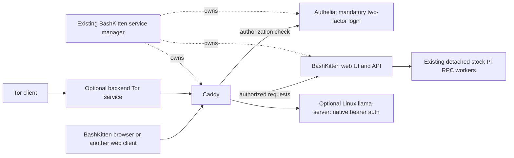

# BashKitten browser integration plan

Proposed architecture, 22 September 2026. This records the new requested
direction; it does not claim that the migration is implemented or tested.
For the migration, this plan supersedes the older Android/Termux suite plan
where they differ. Existing releases continue working until their replacements
pass the checks below. No donor repository, branch or release is deleted as part
of preparing this plan.

## 1. Product boundary

Make BashKitten a Firefox-based browser on Android and Linux, using the existing
WildBuzzard browser code. Keep the current BashKitten web UI and shared server.
The browser displays the Agent interface and controls its local service; Node,
Pi, Caddy and Authelia run outside the browser, in Termux or native Linux.
Server-only installations remain supported.

Preserve the chat renderer, project/session sidebar, thinking and tool streaming,
compaction display, attachments, repository browsing, backend ZIP downloads,
provider login and native Pi session behavior. Pi remains stock: its own tools,
extensions, skills, models, credentials, sessions and RPC. This is not another
Pi adapter rewrite.

Replace the Android WebView and Linux GTK/WebKit hosts with the browser. Remove
the Termux-suite distribution/store integration, API/X11 APK requirements,
X11 variant selection and graphics/display profiles. Keep package maintenance,
real APT/npm progress, backend controls and Pi stop/kill controls. No application
is automatically uninstalled, including previously installed suite components.

Keep Waterfox-derived privacy features, private tabs, Tor, ad blocking and normal
browser functions. Remove torrents, qBittorrent/libtorrent, their exclusive
Qt/Boost/build dependencies, custom search/torrent extensions and their special
permissions. Remove the external WildBuzzard extensions repository dependency.
Ordinary address-bar search, downloads and normal Firefox extension support are
not the custom search implementation being removed.

## 2. Repositories and Firefox updates

Use **two product repositories**, with Android and desktop sharing **one browser
repository and one product branch**:

```text
openresearchtools/bashkitten                 # existing small web/server repo
  src/web/                                  # existing shared UI
  src/server/
    rpc/                                    # existing stock Pi integration
    files/                                  # existing files/folders/ZIPs
    http/                                   # private backend behind Caddy
    access/                                 # Caddy/Authelia/Tor configuration
    platform/termux/                         # bootstrap, pkg, environment note
    platform/linux/                         # Linux service/files/llama runtime
    updates/                                # existing package/npm job machinery
    control.mjs                             # existing lifecycle owner, extended
  packaging/{termux,linux}/
  docs/

openresearchtools/bashkitten-browser         # proposed merged Gecko fork
  browser/                                  # Firefox desktop, normal layout
  mobile/android/                           # GeckoView/Fenix, same Gecko tree
  toolkit/, dom/, netwerk/, ...              # required upstream Mozilla tree
  bashkitten/                               # renamed existing wildbuzzard/
    browser/                                # retained browser features
    android/                                # branding, Binder, Termux bridge
    components/                             # shared native browser tools
    pi/                                     # one extension, platform transports
    branding/, scripts/, licenses/
    upstreams.toml, ports.toml, UPDATING-FIREFOX.md
  .github/workflows/                        # Android + Linux build matrix

openresearchtools/apt                        # existing final .deb distribution
```

These are ownership boundaries, not instructions to create every directory or
rewrite existing modules. Keep the existing Mozilla layout to make upstream
merges manageable. The browser release owns its Pi extension; the server
package/updater installs that exact release through Pi's normal package support.
Do not keep separate copied Android and desktop extension implementations.
Remove `src/android/` and `src/linux/` from the server repository only after their
replacement features and upgrade paths work.

### Starting sources, checked on 22 September

| Source | Recorded starting point |
| --- | --- |
| BashKitten server/UI | `main`, `b20cf1cbf56a12a47a5f7a954bb473986539e230` |
| Desktop browser product | `WildBuzzard`, `refactor/browser-agent-independent`, `0bd2d7da099a365d2243b320e1e6b38e8ad76cf4` |
| Android browser | `wildbuzzard-android`, local `main`, `b970e591350863113c7ea1f110f12f296a1170bd` |
| Current browser Firefox pin | `FIREFOX_153_2_0esr_RELEASE`, `feec67e62a5148b41fd017ccbbc463e8a6f9e83d` |
| Newer official ESR tag already available | `FIREFOX_153_3_0esr_RELEASE`, `861fdeb0d32fe1bd101fea886687e680f612d735` |
| Torkitten reference | `main`, `783c0899029aad22cec9562142c067f6b55408a7` |

The recorded desktop product commit is already an ancestor of the Android
checkout. Start with that shared history and reconcile any subsequent donor
changes once; there is no need to combine two unrelated Gecko trees. The
desktop repository's default `main` is not the product branch listed above.
Recheck both product heads at implementation time. Preserve ongoing Android
work, including the currently modified README and UI audit; do not absorb
uncommitted donor files into the migration.

Keep one product `main`, one pristine Mozilla ESR 153 tracking ref and exact
upstream release tags. Fetch only the chosen ESR branch/tags, not every Mozilla,
Waterfox or recovery branch. Preserve the initial ESR baseline, retained donor
commit records and license provenance. The current Waterfox donor is
`8ae6e039a06bcff8173cb4a4c0262beb21f81286`; keep applicable `ports.toml` records.

Reuse `firefox_release.py`: detect a new 153.x ESR release, fetch its exact tag,
merge it into the product line, update the pin, resolve actual conflicts and
build both platforms. First reconcile the donors, then update the unified tree
to 153.3.0esr or the newer verified 153.x release. Do not automatically change
ESR major or rebase every product commit for each update. CI can propose the
update and build it; failed merges/builds cannot publish a release.

Removing branches and unused features reduces maintenance and build inputs.
It does not erase objects already in retained Git history. Use shallow/partial
clones for ordinary builds and a checkout with sufficient ancestry for upstream
merges; do not rewrite Mozilla ancestry just to make the repository look small.

Rename product names, package namespaces, executable/control names, branding,
URLs and preferences deliberately. Android keeps **`com.bashkitten`**, the
existing Droid signing key and a monotonically increasing version code so this
replaces the current BashKitten APK. Historical copyrights, upstream links and
license attribution retain their original names. Do not replace or rename an
installed independent WildBuzzard application.

## 3. One window and a protected Agent view

One product profile and one browser window. Remove profile creation/switching
and new-window/private-window commands. Reject alternate-profile/new-instance
launch flags and disable profile creation through internal profile pages too.
OS URL launches, `window.open`, OAuth
popups and links requesting another window open ordinary tabs in the existing
window. File pickers and permission dialogs remain normal platform dialogs.
Private browsing uses private tabs, including on Android; completing Android's
single-window tab behavior is explicit work, not an assumption about Fenix.

Implement Agent as a browser-owned content view outside the ordinary tab
registry, presented as the permanent Agent tab. A pinned ordinary tab is not
sufficient. The browser creates exactly one, always selects it on startup and
restores it after a content-process crash. User tab-close/close-all/duplicate,
session restore and agent tab commands cannot remove, duplicate or replace it.
The user can still quit the application normally.

On phones, place **Agent** to the left of the address bar while browsing. In
Agent, replace the URL toolbar with a compact Agent/Local-or-Remote/menu bar.
On desktop, tablets and unfolded phones, show Agent beside the selected ordinary
tab. Agent toggles the pane; hiding it gives web content the full area without
destroying the chat document. Narrow layouts switch between Agent and browsing.
There is never a second application window. Preserve chat drafts and scroll
position when toggling, rotating or folding.

Enforce the protected-view boundary in native tab lookup and tool dispatch,
not just button visibility. Agent automation and normal extension tab APIs
cannot enumerate, screenshot, inspect, execute script in, navigate or close
Agent, setup, authentication or remote-credential views. Block whole-window
screenshots through the agent interface when they could include those views.
Browser-owned authentication content remains an unprivileged web document;
never give a remote server's HTML browser-chrome privileges.

Keep a single browser tool surface using explicit ordinary-tab IDs. Remove
profile/window selection, browser-session ownership machinery, torrent tools
and quit/restart commands. Keep useful tab navigation, DOM, input, screenshots,
network/debugging and file actions. Closing the last ordinary tab leaves Agent.
Concurrent Pi sessions use explicit tab IDs rather than a shared selected-tab
variable. Pi's own session identities and history are unaffected.

Reuse Android Binder and the desktop private Unix socket. Authorize callers
through the existing native permission flow; do not revive the legacy Android
TCP command-key service. If a selected remote Pi is allowed to control this
client browser, the browser opens an authenticated outbound connection through
the selected server. The user grants that connection browser control in native
UI. Reuse the same tab dispatcher over that channel; do not expose a public
browser-control listener or another MCP server. Close/revoke it on logout or
remote switch, and revalidate authorization on reconnect.

This protects browser automation interfaces. Stock Pi retains its unrestricted
shell: on the same OS account it can still run OS commands such as killing a
process. Preventing that would require a separate OS sandbox and would conflict
with the requirement to leave native Pi unrestricted.

## 4. Android setup with ordinary Termux

Opening **Local** checks the recorded service, then uses the Termux command
bridge to attach/start it if needed. If that fails, Agent shows the packaged
onboarding page. It works before the backend exists. A selected remote does
not need a local Termux installation merely to display that remote's UI.

1. If `com.termux` is absent, offer **Download Termux** using the current
   official GitHub release's matching APK and the browser's normal download and
   Android installation flow. Do not substitute our old suite build.
2. Open Termux for its initial bootstrap. Show one copyable command that enables
   external apps, reloads settings and returns to the installed BashKitten
   activity. The final activity component must come from the actual new APK.
3. On return, BashKitten requests Android's `com.termux.permission.RUN_COMMAND`
   permission directly. Verify a real command result before marking connected.
   Denied/permanently denied permission gets an appropriate Retry/Settings link.
4. Install our keyring and server through the existing authenticated package
   flow, display real progress, start the service and complete account/2FA setup.

The command's core remains:

```sh
mkdir -p ~/.termux && printf '\nallow-external-apps=true\n' >> ~/.termux/termux.properties && termux-reload-settings
```

The installer should avoid accumulating duplicate settings on repeated setup.
Append the explicit Android return intent after this command. The shell does
not grant an Android permission; the foreground BashKitten activity requests
the normal system dialog. The return intent accepts no arbitrary command to run.
This follows Termux's [RUN_COMMAND interface](https://github.com/termux/termux-app/wiki/RUN_COMMAND-Intent).

Existing compatible Termux installations stay installed. Use their ordinary
command interface; no signing match or new Termux patch is required. Retain an
existing suite-specific connection only as upgrade compatibility while moving
to the standard path. Permission for Termux/Pi to control the browser is a
separate native browser grant from permission for BashKitten to command Termux.
Present both during setup when required; do not claim one grant covers both.

Keep Node, Pi, Python, git, gh, archive utilities, the existing X11 repository and
useful desktop packages such as LibreOffice. Add the native `xorg-server-xvfb`
package for headless display and `xdotool` where needed. No Termux:X11 APK,
Termux:API APK, proot, root or Android shared-storage permission is required.
Do not remove already installed desktop packages simply because their old
control panel disappears. The short managed Pi environment note explains
Termux/Bionic, `pkg`, skill locations and how to start an owned Xvfb display
with `-nolisten tcp`, use `DISPLAY`, and stop its own display afterwards.
Do not describe the Termux:X11 APK-dependent server as headless Xvfb.

Keep package controls in the app's setup/settings area with an expandable
installed-packages list, explicit **Check for updates / Update packages**,
APT/npm/Pi stages and the existing bounded, scrollable real output. Reuse the
manager's durable jobs and locks. No package-network checks on every chat open.
Replace suite APK cards with the relevant Termux setup/status and BashKitten
update controls; there is no remaining suite app store to maintain.

Browser upload/download/paste uses Gecko and the Android picker. Backend folder
choices remain writable Termux home paths. Completion notifications move from
Termux:API to the browser's Android notification integration, with user-controlled
notification permission and deduplicated turn IDs. Receive them over the live
authenticated service connection, using a user-enabled foreground service for
background delivery. Force-stopping the browser prevents delivery until it is
opened again; do not claim the OS cannot kill it. No Pi modification is needed.

## 5. One managed HTTPS/authentication service



Reuse Torkitten's configuration patterns, source attribution and private socket
boundaries, not its OCI container deployment. Extend the existing Node manager
to launch native Caddy, Authelia and the shared web backend as one service group.
Use Authelia's file user store, SQLite storage and built-in memory sessions;
no Redis, LDAP, second BashKitten account database or custom authentication layer.
Reuse Torkitten's local account/TOTP enrollment approach, calling Authelia's own
commands/APIs and requiring a valid second factor before setup completes.
Enrollment is available only through the local private setup controller; remote
visitors cannot claim an uninitialized server. Include local recovery of an
owner's factor without adding a remote authentication bypass.

Caddy is the only web entry point. Backend and authentication/admin endpoints
use private Unix sockets where supported, not a second public HTTP port.
Protect chat, RPC, events, files, uploads, settings and WebSocket upgrades using
Authelia `two_factor` forward authentication. Strip incoming identity/forwarded
headers and derive identity only from the trusted proxy. Keep Origin/CSRF and
filesystem confinement checks. Only the required login assets/endpoints and
non-sensitive public About/licenses are outside login. Long-lived authenticated
channels must close on logout/revocation and reauthenticate after expiration;
authenticating their initial upgrade alone is not indefinite authorization.
See [Authelia's Caddy integration](https://www.authelia.com/integration/proxies/caddy/).

**Local address:** use a stable per-installation name such as
`<instance>.local.bashkitten.com`, with an unprivileged HTTPS port. BashKitten's
browser maps that exact registered name to loopback internally, including
offline, and never sends it to a public resolver. Authelia requires a suitable
cookie domain; bare `localhost`/IP URLs are not its normal supported setup.
The web application remains usable in other browsers when that hostname is
resolved and its CA trusted. Optional wildcard loopback DNS under the owned
domain can simplify that, but is not a requirement for our browser and needs
separate DNS configuration. Do not keep an unauthenticated localhost bypass.
[Authelia cookie-domain requirements](https://www.authelia.com/configuration/session/introduction/#domain).

Use Caddy's internal CA and HTTPS certificates. The local bridge supplies the
public CA/identity to the browser over the existing trusted local channel.
Remote enrollment supplies the corresponding identity. Trust only that enrolled
server/origin in its Agent/remote context; never globally trust arbitrary
self-signed certificates or disable certificate verification. Keep hostname,
expiry and key-change checks. Trust the persistent CA rather than a short-lived
leaf so automatic certificate renewal does not break the connection. Reuse and
tighten Android's existing enrolled-onion TLS handling, and implement the same
scope on desktop. No user certificate import is needed in BashKitten. Other
browsers retain their normal certificate trust rules.
[Caddy local HTTPS](https://caddyserver.com/docs/automatic-https#local-https).

The service group is ready only when all three components are healthy. An exit
or failed health check stops the public edge and restarts the group with bounded
backoff. Authentication failure never falls back to direct backend access.
This gives coupled lifecycle, not literally one process. Keep component output
bounded and credentials redacted. Optional Tor failure removes remote readiness;
it need not destroy a working local chat. Optional llama failure is handled by
its own restart path, not by restarting authentication.

If the manager itself is killed, the proxy's authentication rules still apply.
On recovery, reconcile recorded process identities and either attach to the
complete healthy group or replace only its owned incomplete group. Do not claim
an already-dead supervisor can immediately coordinate the surviving processes.

Keep the existing single-instance locks and verified service discovery. Reserve
a free public port, keep the successful choice when available and persist the
actual address and instance identity only after readiness. Handle bind races
by retrying; never attach to a port just because something responds there.
On Android resume, request status through Termux and recover unexpectedly dead
components. Closing the browser does not stop the service. A deliberate Stop
stays stopped until Play. Pi workers remain detached across web/auth restarts;
their native session files remain the recovery source. Stop/kill Pi stays an
explicit separate action.

Browser cookies survive browser restarts. Authelia's stock memory session store
does not survive an Authelia restart, so that restart requires login again;
do not add Redis merely to conceal this distinction.

**First technical gate:** Termux currently packages Caddy, but an Authelia recipe
was not present at the checked upstream package path. Build a pinned native
Android/Bionic Authelia package, including its frontend assets and dependencies,
and publish it through our APT when verified. Prove SQLite, password hashing,
TOTP enrollment and Caddy forward-auth on unrooted Termux before replacing the
working login. Do not relabel a Linux/glibc ARM64 binary as Termux aarch64 or
quietly introduce a container/proot fallback. This portability is not yet tested.

## 6. Remote Agent connections and Tor

Every backend has **Settings → Remote access**: off/on, address, QR, save/import
connection file and copy/reveal controls. Keys are masked by default. Publish
through a backend-owned Tor onion service, separate from the browser's client
Tor process. Closing the browser must not stop the published server.

Use Torkitten's v3 client authorization and Caddy/Authelia route pattern. A remote
connection record contains its name, kind, onion endpoint, client authorization
key and scoped TLS trust identity. One compact versioned format supports QR,
file and manual entry; reuse the existing browser import controls rather than
three implementations. A compact CA public-key pin can be carried in the QR;
enrollment must verify the presented CA against it. Manual onion-address/key
entry can obtain and pin the CA through the authenticated exact v3 onion
connection, using the existing narrowly scoped enrolled-onion TLS handling.
It needs no extra certificate-import step, allows no clearnet fallback and
does not grant trust to other sites. Keep passwords and TOTP seeds out of
connection exports. Tor access does not bypass Authelia
login or its mandatory second factor.

Store secrets through Android Keystore or the existing desktop NSS secret store.
Never navigate to credential-bearing QR URLs or put them in browser history,
referrers or logs. Imported server authority is limited to the selected remote;
it cannot acquire local package-install/shell-control permissions. Server-side
device key revocation disconnects that enrollment. Use separate Agent and llama
Tor identities when their access needs independent revocation: Tor client auth
protects a whole onion service, not individual URL paths.

The Agent bar has **Local / named remote** selection and connection status.
Switching changes the protected view's server while keeping per-server login
state and reconnect information. It does not create a browser profile or window.
An ordinary onion link remains an ordinary private Tor tab. The enrolled Agent
context can persist its login independently; its cookies/keys never become the
ordinary onion tab's session. Enrollment/remote-management tools are not exposed
to the agent automation API.

## 7. Desktop llama.cpp and the browser's loopback relay

There are two distinct functions: a Linux backend can run/publish llama.cpp;
the desktop browser can expose a remote llama endpoint to local clients.
Neither function hosts the Agent server inside the browser. Android keeps its
remote Agent client without the desktop llama runtime/relay feature.

For a published llama endpoint, use the same Caddy instance with a separate
exact host/onion route to the loopback llama-server. That route does **not** use
Authelia. Keep llama.cpp's own bearer-token validation, preferably configured
with `--api-key-file`. Proxy the original method, path, query and body; do not
strip `/v1` or convert its API. Do not attach Agent cookies or identity headers.
The token belongs to llama.cpp, not a second Caddy token database.

In desktop **Remotes → Add → llama.cpp**, reuse QR/file/manual import and show
health plus the assigned local port. The browser's narrow loopback listener
forwards to exactly that enrolled HTTPS onion through its own Tor connection
and inserts the stored `Authorization: Bearer …` header. Stream responses and
uploads with backpressure, preserve status/content types and cancellation, and
support the endpoint's streaming transports without buffering complete turns.
Never fall back to clearnet or follow a redirect that would leak the credential
to another origin. Replace caller-supplied authorization, strip browser cookies
and validate the listener's Host/Origin so a web page cannot use it as an open
authenticated proxy. It remains a service for trusted local OS clients.

Bind only loopback, remember/reserve each endpoint's port, and report a bind
conflict rather than connect to an unknown listener. If a new port is selected,
show it and update only BashKitten-managed provider configuration. Any normal
OpenAI-compatible client can use `http://127.0.0.1:<port>/v1`; Pi uses its standard
custom-provider configuration. A remote Pi runs on the remote host: its
`localhost` is not this desktop, so configure its model endpoint on that host.
Do not imply a browser-local port is automatically reachable by a remote agent.
The relay is available while this browser is running; closing it closes that
port. This is the deliberately requested browser relay, not a second chat server.

For a **managed local Linux runtime**, reuse the current packages from
[llama-deb](https://github.com/openresearchtools/llama-deb): `llama-cpp`
(Vulkan/CPU) or `llama-cpp-cuda` for both Debian arm64 and amd64. They conflict
because they supply the same commands. Use APT for an actual change, show its
output and never reinstall an already satisfied selection. Do not bundle both
runtimes, NVIDIA drivers, Unsloth Studio or PyTorch into the browser.

Auto selection probes the available driver/devices and verifies the selected
llama binary can load its backend. Prefer CUDA only when the packaged CUDA 13
runtime, driver and supported device actually work; otherwise use supported
Vulkan or explicit CPU mode. Retain an override. Unsloth's
[setup/detection code](https://github.com/unslothai/unsloth/blob/main/studio/setup.sh)
is a reference, not a new dependency. The existing CUDA packages require system
CUDA/driver libraries; merely seeing an NVIDIA vendor ID is insufficient.

The existing backend manager starts an owned llama-server with the chosen model
and options when that managed provider is selected. Show Starting/Loading/Ready/
Failed and wait for model readiness before offering it as ready. Restart a
crashed owned process with bounded backoff; deliberate Stop remains respected.
An existing external HTTP provider is probed, not killed or restarted. Failed
in-flight inference is reported to stock Pi without silently replaying a prompt.
`/health` alone is not proof of token validity: upstream deliberately exempts it
from API-key checks. Also verify an authenticated model request and the selected
model. [llama.cpp server interface](https://github.com/ggml-org/llama.cpp/tree/master/tools/server).

## 8. Delivery, retained behavior and licenses

Build the browser for Android `arm64-v8a` and Linux `arm64`/`amd64`; keep the
server's native Termux `aarch64` package separate. Verify both 4 KB and 16 KB
Android execution for the APK's native libraries and executable Termux packages.
Keep the APK's current signing identity. Linux browser/server packages use the
existing APT repository. Make the existing `bashkitten-desktop` package upgrade
to the browser-based app with a dependency on the shared server; a browser can
also connect to a remote without running its local backend. The server package
does not acquire a browser dependency.

Reuse current APK update checking/signing and APT/npm jobs, replacing suite
catalog ownership with browser/server release metadata. Preserve selected
external Pi installations and native extension installation. Migrate existing
server paths, sessions and projects; do not move/copy Pi history into the browser.
The new browser has its own cookie store, so the WebView/WebKit-to-Gecko change
and Authelia migration require a fresh login/enrollment, not extraction of old
shell cookies. Preserve old auth data privately until migration succeeds.
Retire suite workflows/catalog use only after migrated clients no longer need
them; do not delete installed applications or current working releases first.

Keep System/Light/Dark in the browser menu, and the shared web UI following the
host preference. Keep normal file uploads, image paste, downloads/open and
backend repository ZIPs on both platforms. Local Linux file/folder actions can
open their real local paths via the OS; for a remote server those paths are
remote, so use its web file/download behavior instead. OAuth opens an ordinary
browser tab and retains Pi's supported callback/device-code behavior. For remote
Pi, use that provider's supported remote/manual callback path; a localhost
callback in a client browser cannot magically reach another machine.

Keep About/Licenses in the browser menu, available offline and before login,
and keep web About/Licenses. Reuse their current renderer/style with an accurate
browser/server inventory. Node, Termux and OS libraries retain their own external
package notices; Pi/npm dependencies bundled in the server remain in its license
inventory even though the server is installed separately from the APK.

Preserve Mozilla/Waterfox MPL notices, BrowserOS-derived AGPL notices, Mozilla
DevTools MCP attribution, retained ad-block data licenses, Tor and all remaining
native/npm dependency notices. The browser currently follows AGPL-3.0-or-later
for the combined product; do not relabel it as wholly GPL or erase per-file
licenses. BashKitten's existing code remains GPL-3.0-only, including any copied
integration portions. Preserve Torkitten's Apache-2.0 notices for reused code.
Account for GPLv3/AGPLv3 combination terms and MPL files marked incompatible with
secondary licenses when integrating, rather than blanket-changing headers.
See [GPLv3 section 13](https://www.gnu.org/licenses/gpl.en.html#section13) and
[Mozilla's MPL guidance](https://www.mozilla.org/en-US/MPL/2.0/FAQ/).

Generate notices from what each artifact actually distributes and publish its
matching source/build material. Remove torrent-only inventory entries only
after the corresponding artifacts are gone; historical provenance remains.
Keep browser-facing source access for retained AGPL components. Readmes and
release notes stay short; implementation detail belongs here and in AGENTS.md.

## 9. Implementation order and completion evidence

| Step | Work | Evidence required |
| --- | --- | --- |
| 1 | Native access stack feasibility | Real Authelia enrollment, TOTP login, Caddy, scoped local TLS and private backend on Linux ARM64 and unrooted Cuttlefish Termux; no direct login bypass |
| 2 | Reconcile browser sources and strip removed features | Both browser targets build from one ESR pin; retained Waterfox/Tor features work; no torrent/search-extension binaries or dependency fetches; licenses match artifacts |
| 3 | Rename and add protected Agent view | Existing BashKitten APK upgrades; one profile/window; new-window requests become tabs; protected view survives close-all, restore and crashes and rejects all automation/extension access |
| 4 | Local integration | Existing UI and real stock Pi turn on Linux and Android; official/external and existing suite Termux; one-command return/permission flow; bootstrap, files, OAuth and explicit update jobs |
| 5 | Recovery and wide layout | Kill browser, content process, manager, Caddy, Authelia, backend and Termux separately; reopen finds the correct instance; no port hijack, duplicate servers/prompts or lost Pi history; fold/rotate/toggle preserves chat |
| 6 | Tor Agent remotes | QR/file/manual enrollment, 2FA, TLS renewal, rejected changed identity, revocation, offline/reconnect, ordinary private onion tabs and permission-controlled remote browser tools |
| 7 | Desktop llama | arm64 and amd64 runtime selection; real ready model, crash/restart, wrong token, token-free health distinction; onion relay streams unchanged paths and never leaks credentials/falls back to direct access |
| 8 | Upgrade/release | APK and APT upgrade from installed versions; external Pi preserved; About/licenses without backend; normal independent browser reaches the authenticated server; matching source/notices and no testing payloads |

Use the running Cuttlefish and local Linux ARM64 for actual app interaction,
screenshots and process-failure checks, plus native AMD64 validation. Physical
device checks are required for claimed GPU behavior and foldable behavior the
emulator does not cover. Keep BashKitten-owned verification tools, fixtures,
test profiles and results outside product repositories/artifacts; do not remove
Mozilla's unmodified upstream source tests merely because they are tests.

Stage, commit and push each finished implementation slice, on the agreed product
branch. Re-read this whole plan after compaction. Do not replace stock Pi,
introduce a second browser-control framework, recreate Termux-suite, or rebuild
the web UI while carrying out this migration.
